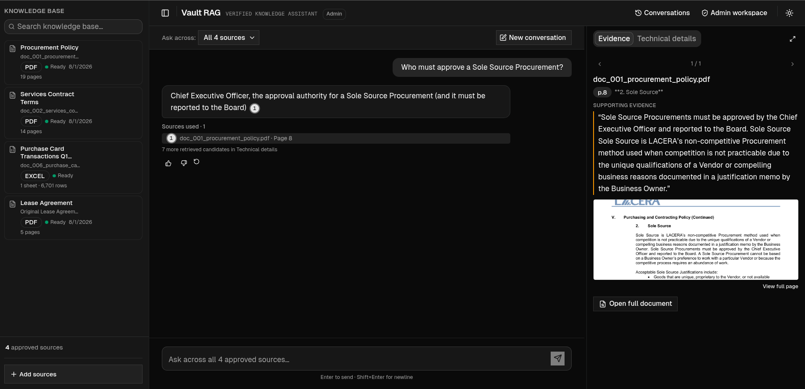
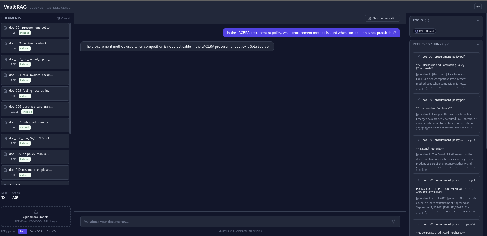
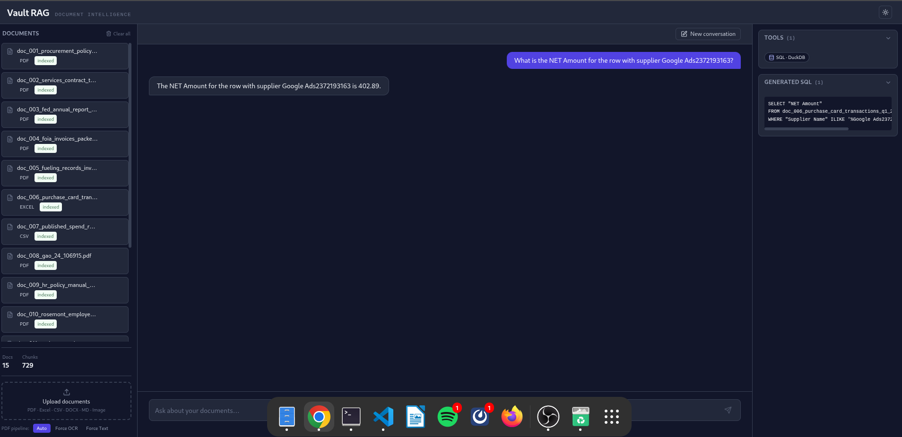
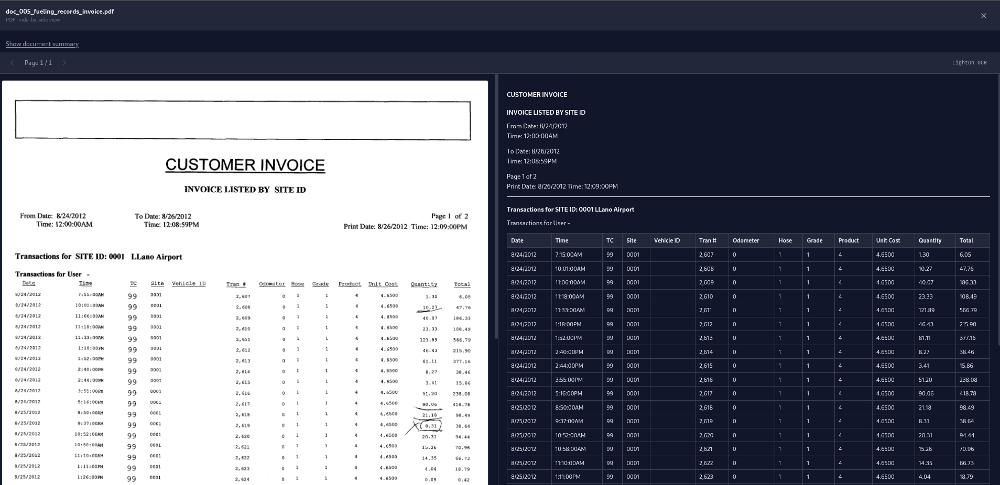
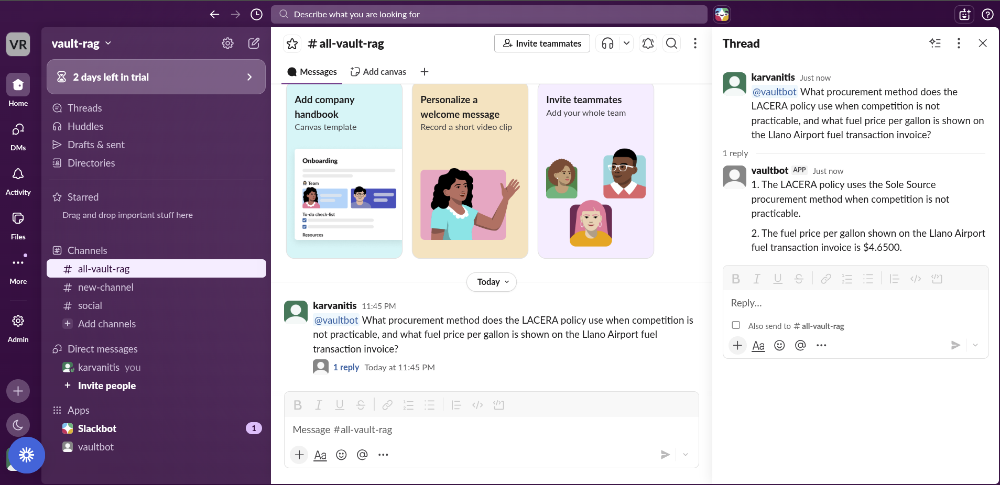

[](https://github.com/k-arvanitis/vault-rag/actions/workflows/ci.yml)


# Vault RAG

Private document knowledge assistant for PDFs, scanned documents, spreadsheets, and mixed business files. Ingests messy company documents, routes scanned pages through OCR, indexes prose and tables separately, retrieves with hybrid dense+sparse search and cross-encoder reranking, and answers only with cited evidence — page-level citations for PDFs, sheet/SQL evidence for spreadsheets. Refuses out-of-corpus questions instead of hallucinating. The storage, OCR, embeddings, Qdrant and DuckDB layers run locally. Generation and optional enrichment use external APIs by default but can be redirected to local OpenAI-compatible endpoints — see [Privacy & data](#privacy--data) for exactly what leaves the machine and how to keep it fully on-prem.

**Who this is for:** Teams with mixed-format internal document collections (PDFs, scanned docs, spreadsheets) who need cited, auditable answers without shipping their files to a SaaS vendor or paying per-page processing fees.

### Best fit for client projects

- Internal knowledge-base assistants over PDFs, scanned PDFs, Excel and CSV
- Cited RAG chatbots with source inspection (click a citation, see the page/row evidence)
- Feedback loop and conversation history baked into the product, not bolted on after
- RAG quality audits and retrieval improvement work
- Self-hosted document Q&A where files should not go to a third-party SaaS vendor

### Not included yet

- Google Drive / cloud-storage sync (planned — see [Known limitations](#known-limitations))
- WhatsApp connector (Slack bot exists today; a WhatsApp/n8n pattern is the next channel)
- Production RBAC / multi-tenant workspaces (current auth is a single shared `X-API-Key`)
- Enterprise SSO
- Full multi-tenant SaaS billing

## Standard RAG workflow demonstrated

- Upload PDFs, Excel/CSV, and scanned documents
- Detect text layer vs. scanned pages
- OCR only when needed
- Chunk with page/document metadata
- Store prose in Qdrant and tables in DuckDB
- Retrieve using hybrid dense + sparse search
- Rerank with a cross-encoder
- Generate answers with page-level citations for PDFs and sheet/SQL evidence for spreadsheets
- Refuse when evidence is missing
- Log evaluation: Hit@K, faithfulness, refusal rate

**Benchmark — 109 questions over 18 mixed-format public documents, graded by an independent `gpt-4o-mini` judge** (distinct from the `qwen/qwen3-32b` answer model, so no self-grading bias). Full, current run — not a stale/partial snapshot:

| Capability | Score | Reading |
|---|---:|---|
| Overall answer correctness — adversarial/stress-test mix (10 types) | **84.7%** | Pulled down by figure-grounded questions and cross-doc joins, the hardest cases |
| Grounded answers (faithfulness) | **79.5%** | Claims supported by / inferable from retrieved text |
| On-topic answers (relevancy) | **86.7%** | Answers address the question asked |
| Finds the right source (retrieval hit@5) | **95.9%** | Correct evidence in the top 5 for nearly every question |
| Structured-data accuracy (Excel/CSV) | **90.5%** | Text-to-SQL over DuckDB returns the correct cell value |
| Refuses unanswerable questions | **78.6%** | Returns `Unsupported` instead of fabricating — see Known limitations |

No eval-set-specific shortcuts — every answer comes from the model and tool outputs. Full methodology and detailed metric breakdowns in [Evaluation](#evaluation).

---

## Demo

<!-- To embed the video inline like GitHub renders user-attachments, drag
     assets/vault-rag-demo.mp4 into a GitHub issue or PR comment, copy the
     resulting https://github.com/user-attachments/assets/... URL, and paste
     it on a blank line below (no markdown wrapper needed). -->


https://github.com/user-attachments/assets/7f3fe838-6336-4a5f-815d-f879a86c57b9




---

## User interface

Four-pane operator console (Next.js, `frontend/`) built around one idea: every answer should be checkable, not just readable.

| Pane | What it shows |
|---|---|
| **Documents** (left sidebar) | Every indexed file with type, status, and last-indexed date. Per document: inspect, re-index (re-runs ingestion on the file already on disk — idempotent point IDs overwrite it in place, no re-upload needed), delete. Drag-and-drop upload zone at the bottom; index totals (docs/chunks) above it; "Clear all" wipes the collection with a confirm step. |
| **Chat** (center) | Streaming answers with markdown + table rendering. Multi-part questions are split, answered, and merged automatically — no special syntax needed. |
| **Trace** (right sidebar, populated per turn) | Three collapsible panels: **Tools** used (RAG · Qdrant vs SQL · DuckDB, as pills); **Generated SQL** for spreadsheet questions; **Retrieved chunks** — every source the agent actually used, each card showing filename, page/sheet, section heading, cross-encoder score (color-coded), and the exact excerpt quoted. A fourth panel, **Retrieved but rejected**, lists the reranked candidates that *didn't* make the cut with their scores — so a viewer can see the model wasn't just handed the top hit, it discarded lower-relevance ones. |
| **Document inspector** (replaces the trace pane on click) | Click any document to open a full-screen view: PDF pages side-by-side with parsed Markdown (chunk boundaries visible), or for spreadsheets, the raw sheet rows next to the cleaned/chunked version the agent actually queries. |
| **Evaluation** (header button, full-screen overlay) | The benchmark dashboard: Hit@K, faithfulness, answer relevancy, refusal rate, and the retrieval/structured/unanswerable breakdowns, read live from the last `make eval` run. A "Run eval" button kicks off a fresh benchmark pass in the background (real LLM calls, a few minutes) and refreshes the numbers when it completes. |

The header also carries an offline banner (missing/unreachable backend) and a light/dark theme toggle. A Slack bot (`slack_app.py`) exposes the same query path outside the browser.

---

## What it does

- Ingests PDFs (born-digital and scanned), Excel, CSV, and figures through one router; no per-format scripts.
- Routes each PDF page independently — text-layer pages skip OCR entirely; only scanned pages hit the GPU.
- Indexes prose in Qdrant (hybrid dense + sparse) and structured spreadsheet rows in DuckDB; the agent picks per query.
- Cites every answer back to a chunk + page (PDF) or a sheet + SQL trace (Excel/CSV) — auditable, not a black box.
- Runs a LangGraph ReAct agent (`src/rag_agent.py`, model `qwen/qwen3-32b` via Groq) over two tools — Qdrant retrieval and a delegated Excel sub-graph (`src/tools/excel.py`, model `llama-3.3-70b-versatile`) that decomposes spreadsheet questions and fans out parallel SQL loops via the `Send` API; a coverage/repair pass and an API-level retry on bare `Unsupported` close common failure modes.
- Two-stage retrieval — stage 1 routes the query to the most relevant document(s) via `document_summary` chunks; stage 2 fetches answer-bearing content from those documents only. Stem-overlap on the filename rescues stage-1 misses when generic phrasing dominates the embedding.
- Asks for clarification on broad queries instead of dumping a file list — when the question spans 3+ unrelated documents, the agent returns `Clarify: <2-4 specific options>` derived from what was actually retrieved.
- Forced API-level retry on bare `Unsupported` responses — mitigates Groq inference nondeterminism by re-running the agent once with explicit doc-routing instructions if the first attempt skipped it.
- Exposes the same backend through three surfaces — Next.js console (upload, chat, document inspector, trace panel, evaluation dashboard), Slack bot, and a FastAPI service.

---

## Architecture

**Two LangGraph graphs are wired into `/query`** — a ReAct agent (`src/rag_agent.py`) for PDF/Qdrant retrieval, and an Excel sub-graph (`src/tools/excel.py`) for DuckDB SQL. Everything else (decomposition, reflection, supervisor graphs in `src/pipeline.py`) is kept for experiments only and is **not on the live path**. Every model used at each step is named below.

```
 ╔════════════════════════════════════════════════════════════════════════════════════╗
 ║  INGESTION                                                                         ║
 ╚════════════════════════════════════════════════════════════════════════════════════╝

  File (PDF / Excel / CSV) ─→ src/ingest.py  (file-type router)
       │
       ├──── PDF ──────────────────────────────────────┐  ├──── Excel / CSV ────────────────────────────┐
       ▼                                                │  ▼                                             │
  parser/pdf_parser.py — PER-PAGE ROUTER                │  src/ingest_tables.py                          │
  text layer ≥ 50 chars on the page?                    │  • an LLM extracts the real schema from the    │
   YES → pymupdf4llm  (reads the text layer; CPU,       │    raw rows — column names, data-start row,     │
         no model)                                      │    footnote-start row, 2-3-sentence summary     │
         + figures → VLM, model:                        │model: qwen/qwen3-32b (Groq, via LiteLLM proxy) │
           meta-llama/llama-4-scout-17b-16e-instruct    │  • rows → DuckDB  (one table per sheet)        │
           (Groq) — raster .png + vector graphics       │    Why DuckDB: in-process, single file,        │
           rendered to an image, swapped for            │    columnar — fast SUM / GROUP BY / AVG, no    │
           [FIGURE_START] … [FIGURE_END]                │    server to run; the agent writes SQL here    │
   NO  → LightOn OCR, model:                            │  • document_summary + sheet_summary chunks →   │
         lightonocr-2-1b-ocr-soup  (local vLLM, GPU)    │    Qdrant for discovery — the row data itself  │
         — whole page as one image, no per-figure VLM   │    never enters the vector store               │
         (PDF_PARSER=cpu → unstructured + tesseract,    │                                                │
          ~10× slower, no GPU)                          │                                                │
       │ markdown, one block per page                   │
       ▼
  src/chunker.py — 5 passes over the markdown + 1 doc-level pass
    1. page split            — keep <!-- PAGE N --> boundaries (so citations stay page-accurate)
    2. section split         — break on # / ## / ### markdown headers
    3. re-split              — any chunk > 1024 tokens is cut by a recursive char splitter
                               ([FIGURE_START] … [FIGURE_END] blocks are kept atomic)
    4. merge                 — any chunk < 256 tokens is merged into a neighbour
                               (named ## section headers are never merged across)
    5. contextual enrichment — an LLM writes ONE sentence — "what this chunk is about" —
                               prepended as CONTEXT before embedding  (Anthropic Contextual Retrieval)
                               model: google/gemma-4-31b-it:free  (OpenRouter, falls back to Groq)
    +. document_summary      — ONE extra chunk per file: the doc_id + a 3-5-sentence summary, so the
                               agent can resolve "the supplier agreement" → doc_017 at query time
       │
       ▼
  src/embedder.py + src/sparse_embedder.py — every chunk gets BOTH vectors
    Dense  — nomic-embed-text  (Ollama · 768-dim · cosine)
             semantic similarity: "term" ≈ "duration" ≈ "period"
    Sparse — Qdrant/bm42-all-minilm-l6-v2-attentions  (BM42, run via fastembed — Qdrant's
             CPU-only ONNX lib, no torch) — exact-token recall for IDs, supplier names and
             transaction numbers that a dense vector smears together
       │
       ▼
  Qdrant — one hybrid collection (a dense + a sparse vector on every point)
    Point ID = int(SHA-1(file_name + "::" + chunk_index))  → IDEMPOTENT: re-ingesting a file
    overwrites its points in place, never duplicates them.


 ╔════════════════════════════════════════════════════════════════════════════════════╗
 ║  QUERY — 2 LangGraph graphs wired into /query                                      ║
 ╚════════════════════════════════════════════════════════════════════════════════════╝

  User question
       │
       ▼
  api.py /query — PRE-AGENT ROUTING  (plain functions, not a graph)
    • multi-part split — _split_multi_part_query fans a two-or-more-part question into separate
      sub-questions; each is answered by its own GRAPH 1 run and the results are merged in code
      (the agent's single-pass synthesis used to silently drop a part)
    • deterministic tool routing — route_question matches each (sub)question against the index:
      top-3 hits on .xlsx/.csv chunks ⇒ query_excel, on .pdf chunks ⇒ search_knowledge_base.
      Spreadsheets keep their rows in DuckDB and only summaries in Qdrant, so the modality of the
      hits is an unambiguous signal. The resolved tool is prepended to the question as a directive,
      so the agent no longer infers the tool from question wording (which mis-routed e.g. a
      scanned-invoice lookup to SQL because the words sounded tabular).
       │
       ▼
  GRAPH 1 — ReAct agent   (src/rag_agent.py — LangGraph create_react_agent, name="vault-rag")
    LLM: qwen/qwen3-32b  (Groq primary, served through the LiteLLM proxy → Groq Llama 3.3 70B / NVIDIA NIM on failover)
    One tool-calling loop. Two tools — each call returns to the agent, which decides
    whether to call again or answer:

   ┌── search_knowledge_base ──▶ PDF / Qdrant retrieval  (no sub-graph — just retrieval + rerank)
   │     step 1 — search the document_summary chunks → resolve which doc_id(s) the question is about
   │     step 2 — scoped hybrid search on those docs (dense + sparse, RRF-fused)
   │              + HyDE query expansion  (HyDE LLM: qwen/qwen3-32b @ temperature 0)
   │              → cross-encoder rerank: top-100 → top-10
   │                reranker model: cross-encoder/ms-marco-MiniLM-L-6-v2  (.env.example + Docker;
   │                BAAI/bge-reranker-v2-m3 is the in-code fallback if RERANKER_MODEL is unset)
   │     └─ ranked chunks ──────────────────────────────────────────────────────▶ back to GRAPH 1
   │
   └── query_excel ───────────▶ invokes GRAPH 2 (below)
                                   └─ per-part answers ──────────────────────────▶ back to GRAPH 1
       │
       │ (only the query_excel branch reaches GRAPH 2)
       ▼
  GRAPH 2 — Excel sub-graph   (src/tools/excel.py — two hand-built LangGraph StateGraphs)
    LLM: llama-3.3-70b-versatile  (Groq)   ← needs EXCEL_AGENT_API_KEY,
                                   without it query_excel is a no-op stub
    Outer graph:  decompose the question per source → Send fan-out (one inner run per sub-Q, in parallel)
                  → synthesize the per-part answers
    Inner graph:  select_table → inspect schema + sample rows → write_sql (text-to-SQL)
                  → run_sql on DuckDB → evaluate
                    ├─ rows look right → LLM extracts the answer value
                    ├─ SQL error       → retry the SAME table once, with the error pasted into the prompt
                    └─ 0 rows           → fall through to the NEXT candidate table
                  Candidate tables ranked by question ↔ column-name token overlap.
                  ILIKE auto-truncates trailing chars to recover names the parser cut short.
       │
       ▼
  Post-processing — plain functions, NOT graphs
    • src/rag_agent.py — _coverage_check + _repair_incomplete_answer: if a multi-part answer used
      < 2 sources, list the missing sub-queries, retrieve again, re-answer — accepted only if the
      retry actually pulled in a source file that wasn't already in the candidate pool
    • api.py — answer is a bare "Unsupported"? re-run GRAPH 1 once with an explicit doc-routing
      instruction (mitigates Groq temp-0 nondeterminism); keep the original abstention if that also fails
       │
       ▼
   Cited answer   (chunk + page for PDF · sheet + SQL trace for Excel/CSV)
```

---

## Key engineering decisions

Four design choices that materially moved eval scores. The full writeup of these and the rest (HyDE expansion, three-pass table repair, sheet-summary sample values, deterministic tool routing, context-overflow retry) lives in [docs/engineering.md](docs/engineering.md).

**Per-page PDF routing.** Every PDF page is routed independently, not the whole document. Pages with ≥50 chars of extractable text go through pymupdf4llm on CPU with zero API calls; scanned pages (no usable text layer) go to a local LightOn OCR vLLM server. Mixed documents — a contract where pages 1–10 are digital and page 11 is a faxed addendum — are handled correctly per page with no configuration. OCRing born-digital pages would *introduce* errors on numbers and equations that are already perfect as text.

**Dual-modality retrieval — Qdrant for prose, DuckDB for tables.** Vector search breaks down for spreadsheets: a dense vector for *"how much did supplier X pay"* is semantically similar to every row in a payment sheet — the right answer needs exact string matching and aggregation (`SUM`, `GROUP BY`), not proximity in embedding space. So Excel/CSV rows go to DuckDB (in-process, columnar, no server) and only summaries go to Qdrant; PDFs and OCR chunks go to Qdrant (hybrid dense + sparse, reranked). `route_question()` resolves the path deterministically from the modality of the top-3 hits before the agent runs, so the LLM never has to guess.

**Deterministic Qdrant point IDs.** Every point gets a SHA-1 hash of `(file_name, chunk_index)` instead of a random UUID. Re-ingesting the same file overwrites vectors in place rather than appending duplicates. With random IDs, re-running ingestion silently doubles every chunk and degrades retrieval precision without any visible error — a subtle bug that surfaces only as gradually-worse answers.

**Contextual retrieval at ingest.** For each chunk a fast LLM writes one sentence describing its topic, entities, and purpose; that sentence is prepended before embedding ([Anthropic Contextual Retrieval, 2024](https://www.anthropic.com/news/contextual-retrieval)). The background shown to the LLM adapts to document length — full document text when it fits the token budget, otherwise summary + a bounded window of neighbouring chunks, so per-chunk cost stays bounded on a 150-page report. Each vector then captures both what the chunk is *about* and what it *says*, sharply improving recall for short or indirect queries.

### Retrieval-quality refinements

A second wave of changes after manual UI testing closed specific failure modes — Unsupported-despite-present-data, irrelevant source chunks, file-list dumps for vague queries, and bare-filename "answers". All fixes are domain-agnostic (no question-specific shortcuts). On the earlier refusal subset, these changes improved the rate from 75% to 100%. After adding four harder missing-field questions, the current expanded benchmark scores 78.6%. Highlights: stem-overlap doc-routing boost + force-inject, per-doc slot reservation in the reranker, neighbor-chunk expansion, prompt-driven `Clarify:` rule, content-based bare-filename answer guard, source-diversity acceptance check on the repair pass, and an API-level forced retry on bare-`Unsupported`. Full rationale + trade-offs: [docs/engineering.md](docs/engineering.md#retrieval-quality-refinements).

---

## API endpoints

The FastAPI service (`api.py`, `make api` → http://localhost:8001) is the backend for the Next.js frontend in `frontend/`. Mutating endpoints require the `X-API-Key` header when `API_KEY` is set in `.env`.

| Method | Path | Auth | Description |
|---|---|---|---|
| `GET` | `/health` | — | Liveness probe |
| `POST` | `/query` | — | Run a single agent query; returns `{answer, sources, rejected_sources, sql, tools_used}` — each source carries `page`/`chunk_id`/`quote` for citation traceability |
| `POST` | `/ingest` | yes | Upload a file (`multipart/form-data`) and start an ingestion job; returns `{job_id}` |
| `GET` | `/ingest/status/{job_id}` | — | Poll an ingestion job status |
| `GET` | `/documents` | — | List all indexed documents grouped by filename, with `last_indexed_at` |
| `DELETE` | `/documents/{filename}` | yes | Remove all Qdrant points for one file |
| `POST` | `/documents/{filename}/reindex` | yes | Re-run ingestion on a file already in `data/input/` — idempotent point IDs overwrite it in place |
| `GET` | `/stats` | — | Index totals (`{total_docs, total_chunks}`) |
| `DELETE` | `/collection` | yes | Drop the Qdrant collection (destructive — wipes the index) |
| `GET` | `/documents/{filename}/chunks` | — | All Qdrant chunks for one document, sorted for the inspector |
| `GET` | `/documents/{filename}/markdown` | — | Parsed markdown for a document, split by page |
| `GET` | `/documents/{filename}/pdf/info` | — | Total page count for a PDF |
| `GET` | `/documents/{filename}/pdf/{page}` | — | Render one PDF page as base64 PNG |
| `GET` | `/documents/{filename}/table-sheet/{sheet}` | — | Raw rows + cleaned markdown for one Excel/CSV sheet |
| `GET` | `/eval/summary` | — | Last computed benchmark results (Hit@K, faithfulness, refusal rate, …) |
| `POST` | `/eval/run` | yes | Kick off the full benchmark in the background (real LLM calls, several minutes); returns `{job_id}` |
| `GET` | `/eval/status/{job_id}` | — | Poll an eval run started via `/eval/run` |
| `POST` | `/feedback` | — | Record a thumbs up/down (with an optional reason: wrong source / hallucinated / should have refused / missing document) on an answer |
| `GET` | `/feedback` | yes | List all feedback records for the admin review queue, newest first |
| `PATCH` | `/feedback/{id}` | yes | Resolve a feedback record with an admin action + note (e.g. "add to eval set", "mark correct source") |
| `POST` | `/conversations` | — | Create or update a saved conversation (`{id, messages}` — omit `id` to create) |
| `GET` | `/conversations` | — | List saved conversations (metadata only), newest first |
| `GET` | `/conversations/{id}` | — | Return one saved conversation with its full message history |
| `DELETE` | `/conversations/{id}` | — | Remove a saved conversation |

CORS allow-list is read from `API_CORS_ORIGINS` (default `http://localhost:3000`).

---

## Evaluation

109-question benchmark over 18 real public documents: procurement policies, legal contracts, government annual reports, scanned invoice packets, FOIA disclosures, Excel/CSV spend reports, HR handbooks, open-data maturity datasets, an SOP/operations manual, and a lease + amendment package. Ten question types: OCR extraction, table lookup, numeric lookup, numeric reasoning, figure grounding, table grounding, negation check, cross-document comparison, single-doc factoid, and unanswerable.

The Results below are from the current full `make eval` run — all 109 questions, all 18 documents. Judged by `gpt-4o-mini` (OpenAI), separate from the `qwen/qwen3-32b` answer model. See [Recent fixes](#recent-fixes) for what changed since the previous numbers.

### Benchmark corpus

All 18 documents are publicly available or user-provided (see the manifest for source notes). `make seed` automatically downloads and ingests a representative starter subset (doc_001, doc_002, doc_004, doc_007) — one born-digital PDF, one contract PDF, one scanned/OCR PDF, and one CSV — so the system is immediately queryable after setup, exercising all three ingestion paths with no manual downloads required.

| Doc | Title | Type | Format | Source |
|---|---|---|---|---|
| doc_001 ★ | Policy for the Procurement of Goods and Services (PGS) | Policy | PDF (born-digital) | [lacera.gov](https://www.lacera.gov/sites/default/files/assets/documents/board/Governing%20Documents/General%20Policies/Purchasing_Policy_Goods_Services.pdf) |
| doc_002 ★ | Appendix C – Terms and Conditions of Contract for Services | Contract | PDF (born-digital) | [publishing.service.gov.uk](https://assets.publishing.service.gov.uk/media/5abcfd7fed915d44eb7e6969/Terms_and_Conditions_for_Services.pdf) |
| doc_003 | 111th Annual Report of the Board of Governors of the Federal Reserve System, 2024 | Annual report | PDF (born-digital) | [federalreserve.gov](https://www.federalreserve.gov/publications/files/2024-annual-report.pdf) |
| doc_004 ★ | Marie Campbell FOIA Complete – Portable & Dumpster Rentals | FOIA / invoices | PDF (scanned) | [bensenville.gov](https://www.bensenville.gov/DocumentCenter/View/20216/17021_Marie_Campbell_FOIA_Complete) |
| doc_005 | Other Pertinent Forms and Reports – Fueling Records | Invoice | PDF (scanned) | [ntsb.gov](https://data.ntsb.gov/Docket/Document/docBLOB?FileExtension=.PDF&FileName=Other+Pertinent+Forms+and+Reports+%28fueling+records%29-Master.PDF&ID=40393413) |
| doc_006 | Purchase Card Transactions Qtr1 2025-26 | Spend table | Excel | [doncaster.gov.uk](https://www.doncaster.gov.uk/services/the-council-democracy/payments-to-suppliers-reports-2025-26) |
| doc_007 ★ | Published Spend Report April 25 | Spend table | CSV | [doncaster.gov.uk](https://www.doncaster.gov.uk/services/the-council-democracy/payments-to-suppliers-reports-2025-26) |
| doc_008 | 2024 Annual Report: Additional Opportunities to Reduce Fragmentation, Overlap, and Duplication | Government report | PDF (born-digital) | [gao.gov](https://www.gao.gov/products/gao-24-106915) |
| doc_009 | Human Resources Policy Manual 2024 | HR policy | PDF (born-digital) | [united-church.ca](https://united-church.ca/sites/default/files/2021-04/hr-policy-manual.pdf) |
| doc_010 | Employee Handbook | Handbook | PDF (born-digital) | [rosemont.com](https://bd-rosemont-images.s3.amazonaws.com/wp-content/uploads/2024/08/15153613/EmployeeHandbook-8.15.24-1.pdf) |
| doc_011 | 2025 Open Data Maturity Questionnaire – Spain | Dataset | Excel | [data.europa.eu](https://data.europa.eu/sites/default/files/2025-12/2025_odm_questionnaire_spain_0.xlsx) |
| doc_012 | OSSE AFE Quarterly and Year-End Reporting Workbook FY2025 | Finance report | Excel | [osse.dc.gov](https://osse.dc.gov/sites/default/files/dc/sites/osse/service_content/attachments/8.%20SAMPLE%20FY25%20OSSE%20AFE%20QUARTERLY%20%26%20YEAR-END%20REPORTING%20WORKBOOK.xlsx) |
| doc_013 | FY26 OSSE AFE Grant Budget & Finance Tracker Workbook | Budget tracker | Excel | [osse.dc.gov](https://osse.dc.gov/sites/default/files/dc/sites/osse/service_content/attachments/4.%20REVISED_FY26%20OSSE%20AFE%20Grant%20Budget%20%26%20Finance%20Tracker%20Workbook%20%24510K_Rev%20Match%20Tab%2015A.5.14.25.xlsx) |
| doc_014 | Supplier Spend Over £500 – April 2024 | Spend table | CSV | [bristol.gov.uk](https://www.bristol.gov.uk/files/documents/8042-supplier-spend-apr-2024) |
| doc_015 | Fixed Food Establishment Standard Operating Procedures Manual | SOP manual | PDF (born-digital) | Michigan MDARD (source URL not recorded — file provided directly) |
| doc_016a | Ross Valley Fire Dept. — Lease Agreement (original, 2020) | Contract | PDF (scanned) | Town of Ross, CA — extracted from a public board packet (source URL not recorded) |
| doc_016b | Ross Valley Fire Dept. — First Amendment to Lease (May 2024) | Contract amendment | PDF (scanned) | Town of Ross, CA — same board packet |
| doc_016c | Ross Valley Fire Dept. — Second Amendment to Lease (Oct 2024) | Contract amendment | PDF (born-digital) | Town of Ross, CA — same board packet |

★ Downloaded automatically by `make seed`. doc_016a/b/c are three separate files extracted from one 104-page public board packet (pages 75–83) — split intentionally so cross-document "which amendment currently applies" questions require genuine multi-document reasoning instead of being answerable from one convenient summary page.

### Results

The high-level capability summary is at the top of the README; this section is the detailed breakdown by metric and modality. All numbers are graded by an independent `gpt-4o-mini` judge (distinct from the `qwen/qwen3-32b` answer model).

**Agent answer metrics** (all 109 questions)

| Metric | Score | What it measures |
|---|---:|---|
| Correctness (adversarial/stress-test mix, 10 types) | **84.7%** | Whether the answer states the facts the question asks for, judged against the gold answer — paraphrases, formatting, currency symbols, and source labels are accepted; exact matches short-circuit the LLM judge. Pulled down by figure-grounded questions (below the pipeline's current capability) and numeric-reasoning joins — single-doc lookups alone score higher |
| Faithfulness | **79.5%** | Whether every claim in the answer is supported by — or inferable from — the retrieved context. Cross-document conclusions count as supported when their component facts are present in the chunks; contradictions, invented facts, and wrong-source mixing are penalised (RAGAS-style, claim-level). Excludes unanswerable + structured questions |
| Answer relevancy | **86.7%** | Whether the answer actually addresses the question asked — not off-topic, not padded with irrelevant context |

**Vector retrieval metrics** (74 PDF/OCR questions, Qdrant)

| Metric | Score | What it measures |
|---|---:|---|
| Hit@5 | **95.9%** | Fraction of questions where a gold evidence chunk appears in the top 5 retrieved |
| Hit@10 | **97.3%** | …same, within the top 10 retrieved |
| MRR | **85.9%** | Mean reciprocal rank of the first gold evidence chunk (1.0 = always ranked first) |
| Evidence recall@10 | **93.5%** | Fraction of *all* annotated gold evidence chunks recovered within the top 10 |

The correct evidence chunk lands in the top 5 for ~96% of answerable PDF questions, with no domain-specific fine-tuning. A cross-encoder reranker (`cross-encoder/ms-marco-MiniLM-L-6-v2` by default, with `BAAI/bge-reranker-v2-m3` as the in-code fallback when `RERANKER_MODEL` is unset) reorders first-stage hybrid (dense + sparse) candidates; the OR-scoped doc_id filter (matching `metadata.doc_id`, `metadata.source_file`, and `metadata.file_name`) ensures scoped searches return full document coverage even for older ingestions that only set `source_file`.

**Structured retrieval** (21 Excel/CSV questions, DuckDB)

| Metric | Score | What it measures |
|---|---:|---|
| Answer accuracy | **90.5%** | Fraction of Excel/CSV questions where the text-to-SQL path over DuckDB returns the correct cell value |

Excel and CSV questions bypass Qdrant entirely. The Excel sub-graph decomposes cross-document questions per source, fans out one inner SQL ReAct loop per part via the LangGraph `Send` API, and synthesises the per-part answers. Each inner loop ranks candidate tables by column-name overlap with the question, then writes / runs / evaluates SQL with retries on column errors, deterministic predicate-relaxation on empty results (drops an over-constraining filter rather than guessing), and a next-table fallback. Tables embedded in PDFs are now loaded into DuckDB too, so `SUM`/`COUNT`-style aggregation questions are answered exactly by SQL rather than by the LLM. See [Recent fixes](#recent-fixes) for a real hallucination bug found and fixed on this path this session.

**Unanswerable questions** (14 questions)

| Metric | Score | What it measures |
|---|---:|---|
| Correct refusal rate | **78.6%** | Fraction of questions with no answer in the corpus where the agent correctly returns `Unsupported` instead of hallucinating |

Questions that cannot be answered from the indexed corpus. The agent is instructed to return the single word `Unsupported` — no hedging, no hallucination. A runtime guard catches a specific failure mode the prompt alone could not: when the agent picks a topically-related document and returns essentially just its filename ("doc_007_published_spend_report.csv") without extracting any value matching the question's data type, the guard converts that to `Unsupported`. The check is content-based — strip filenames + question-echo + framing, and if no substantive token or new numeric value remains, the answer is treated as a refusal failure dressed up as an answer. General to any new document. This corpus was recently expanded with 4 harder "the field genuinely doesn't exist in this table" refusal tests (see [Recent fixes](#recent-fixes)) — the drop from a previous 100% on an easier set to 78.6% here reflects a harder test set, not a regression.

### Recent fixes

Real bugs found and fixed across sessions — not prompt polish, verified with before/after numbers and isolated reproductions, not just re-labeling:

**1. Faithfulness judge was scoring correct, fully-grounded answers as 0%.** The eval judge (previously `gpt-oss-120b`) would sometimes mark a correct cross-document answer as completely unfaithful even when both compared facts were verifiably present in the retrieved context — e.g. a question asking which of two documents identifies "four key vulnerabilities" vs. "42 new topic areas" scored `faithfulness: 0.0` despite a correct, specifically-cited answer. Root cause: judge unreliability on comparative ("which document does X, which does Y") phrasing, not a generation problem — a swap to `gpt-4o-mini` plus a stricter judging prompt fixed the reproduced case. Separately, one *real* generation gap was found in the same investigation: on a different question, the agent skipped retrieving the second document entirely and guessed the second half of a comparison from general domain knowledge ("implied by... typically...") — correct by luck, not by evidence. **Fixed in a later session** (see item 4 below): a comparison-question detector now forces a second, scoped retrieval instead of trusting the model to remember to make it — verified live, before/after, on the exact reproduced case.

**2. The Excel/SQL path was hallucinating instead of refusing when a requested field genuinely didn't exist in a table.** Example: asked for a VAT registration number in a dataset with no such column, the agent returned a real company name as if it were a VAT number. Traced to two compounding prompt/code issues — the SQL-writing step had no instruction that refusing was an option, and the answer-formatting step was hard-coded to *never* abstain once any SQL rows came back. Fixed with an explicit refusal path in the prompt, a rule against SQL column-aliasing tricks that disguise a wrong column as a right one, a code-level fix for a separate bug where the model's own "no rows" phrasing could leak out as a fake answer, and — because prompt instructions alone were verified to still fail sometimes — a **programmatic hard gate** that checks whether the SQL's selected column shares real vocabulary with the question before trusting it, independent of whether the model followed instructions.

| Run | Structured (Excel/CSV) accuracy |
|---|---:|
| Baseline | 28.6% |
| + judge re-check | 42.9% |
| + first repair pass | 61.9% |
| + SQL refusal path & hard gate | 76.2% |
| + 3 broken eval labels fixed (current) | **90.5%** |

Verified via 3 new targeted refusal questions added to the benchmark (each asks for a field that provably doesn't exist in its table) plus repeated isolated re-tests of the original failing case — one case now refuses reliably (4/4), a second improved substantially (from failing every time to succeeding in most repeated trials) but isn't airtight, since it depends partly on the model still following instructions on top of the hard gate.

**Figure-grounded questions (was 33% correctness, n=3) — two distinct failure modes were conflated in that number; one is now fixed.** Traced directly by inspecting the ingested chunks: the VLM figure descriptions (`meta-llama/llama-4-scout-17b-16e-instruct`, at ingest time) are actually accurate in both failing cases — one chunk correctly contains `"$596.3 billion identified between 2011 and 2023 and an additional $71.3 billion identified in 2024"` (the exact gold answer for the Figure 3 question), the other correctly contains `"Defense — Budget: $197 billion"` (the gold answer for the Figure 4 question). Not a vision-model quality problem in either case — two different downstream bugs were losing already-correct information:
- The Figure 4 question ("which mission achieved the largest benefits, **and what amount did it achieve**") was a compound question that the app's deterministic query-splitter breaks into two independent sub-questions before answering. The second sub-question ("what amount did **it** achieve?") ran with zero context from the first, so "it" had no antecedent and the search came back empty. **Fixed**: multi-part splitting now uses an LLM decomposer prompted to keep entity names in every sub-query, so "it" resolves to "the mission with the highest benefits" — verified live, before/after: the answer changed from `Unsupported` to the correct mission and dollar amount.
- The Figure 3 question has no such compound structure and is **not yet fixed**: the agent retrieves a similar-but-different nearby figure chunk instead of the correct one (e.g. the document's $667.5B grand total instead of the $71.3B Figure-3-specific figure) — a genuine retrieval-disambiguation gap between multiple similar figure-description chunks on nearby pages, unrelated to the splitter bug above.

**4. Eval was measuring a different, weaker code path than the live app.** The eval harness called the agent directly, in-process — bugs 1 and the Figure-4 fix above both live in logic that previously existed *only* inside the FastAPI `/query` handler, so a fix verified live in the app would not have moved these benchmark numbers at all. Fixed by extracting the shared routing/retry/comparison/split logic into one module (`src/answer_pipeline.py`) that both the API and the eval harness call — eval now measures exactly what a real user gets. Also found and fixed a real bug surfaced while verifying this: an LLM client was being recreated on every call instead of reused, which is fine at low volume but caused an actual resource leak once multi-part questions started running multiple independent sub-agent passes per question.

### Methodology notes

- **No eval-set-specific shortcuts.** The pipeline contains zero hardcoded extractors, regex patches, or query rewrites tied to specific benchmark questions. An earlier iteration shipped ~290 lines of such code; removing it caused a ~12-point correctness regression, which the current general-fix wave (multi-part-pattern decomp, source-diversity acceptance check, bare-filename guard, auto-scope on filename-token dominance) recovered and exceeded. Numbers represent the genuine generalising behaviour of the agent and tools.
- **Faithfulness is judged at the claim level (RAGAS-style).** A claim counts as supported if it can be *inferred* from the retrieved context — not only if it appears verbatim. So a cross-document conclusion ("X allows a longer term than Y") is faithful when both X's and Y's terms are present in the retrieved chunks; only claims that contradict the context, introduce facts absent from it, or mix values across the wrong sources are penalised. An earlier holistic single-pass judge scored such derived conclusions near zero even when the underlying facts and the verdict were correct, depressing faithfulness ~10 points below its true value. The pipeline is unchanged — this is a measurement-accuracy fix aligning the judge with the RAGAS definition, not a model change. Unanswerable questions are still excluded (a refusal makes no claim and retrieves no context).
- **Correctness ceiling.** The remaining ~20% failures split into: (1) cross-document spreadsheet questions where an entity name has special characters (`*`, `&`, ampersand-collapsed text) that defeat ILIKE matching; (2) LLM column-disambiguation errors (e.g. answering from "Directorate" when the gold value is in "Department"); (3) wrong-cell-within-right-doc cases where the chunk contains multiple candidate values (e.g. an original approval date and a later amendment date) and the model picks the first match; (4) a small number of OCR variances on scanned PDFs. Run-to-run variance from inference nondeterminism is ±2–3 points on correctness and answer relevancy.
- **Retrieval metrics are split by modality.** PDF questions are measured by Qdrant vector hit rate. Excel/CSV questions are measured by DuckDB answer accuracy. Mixing them would penalise the SQL path for never appearing in Qdrant results.
- **Unanswerable questions are excluded from retrieval and faithfulness metrics.** A correct refusal makes no factual claim and retrieves no context — scoring faithfulness against empty evidence would be meaningless.

Full methodology and reproduction steps: [eval/README.md](eval/README.md).

---

## Tech stack

| Component | Technology | Why |
|---|---|---|
| PDF — born-digital | pymupdf4llm | Reading the existing text layer is faster and more faithful than OCR, especially for numbers, tables, and equations |
| PDF — scanned (GPU) | LightOn OCR `lightonocr-2-1b-ocr-soup` (local vLLM) | Scanned pages have no usable text layer; running OCR locally preserves privacy. ~8 GB VRAM at fp16 |
| PDF — scanned (CPU fallback) | unstructured + tesseract | Activated by `PDF_PARSER=cpu`. ~10× slower per scanned page but unblocks CPU-only deployments |
| Figure descriptions (VLM) | `meta-llama/llama-4-scout-17b-16e-instruct` (Groq) | Turns charts and diagrams into searchable text so evidence inside figures is retrievable |
| Contextual summaries | `google/gemma-4-31b-it:free` (OpenRouter → Groq fallback) | Cheap model writes a one-sentence context note per chunk at ingest, with no query-time latency |
| Dense embeddings | `nomic-embed-text` (Ollama, 768-dim) | 8k context, runs in ~2 GB RAM via Ollama — indexing stays on-prem with no external API per chunk |
| Sparse embeddings | `Qdrant/bm42-all-minilm-l6-v2-attentions` (via fastembed) | BM42 attention-weighted sparse vectors — exact-token recall for IDs / supplier names / transaction numbers a dense vector smears; CPU-only ONNX, no torch |
| Structured data store | DuckDB | In-process analytical database — zero ops (no server, just a file), columnar storage makes aggregations (SUM, GROUP BY, AVG) over large spreadsheets fast. Postgres would add a running server, connection pooling, and migrations for a use case that is read-only analytics, not transactions. |
| Vector database | Qdrant | Dense + sparse retrieval in one system with simple local Docker deployment |
| Reranker | `cross-encoder/ms-marco-MiniLM-L-6-v2` (shipped in `.env.example` + the Docker image) — `BAAI/bge-reranker-v2-m3` is the in-code fallback when `RERANKER_MODEL` is unset | Cross-encoder: scores query and chunk *together* in one forward pass, so it models their interaction directly. A bi-encoder scores them independently then compares embeddings — sharply less accurate when the relevance signal lives in the relationship between question and passage, not either alone. The MiniLM is small and pre-baked into the image; bge-reranker-v2-m3 is the multilingual, broader-domain upgrade if you have the VRAM |
| Generation / answering LLM | `qwen/qwen3-32b` (Groq, via the LiteLLM proxy) | 32B params, 32k context, native tool calling and multi-step reasoning — served by Groq at ~400 tok/s with no local GPU; LiteLLM fails over to Groq Llama 3.3 70B, then NVIDIA NIM. Also used for HyDE expansion and the coverage/repair judges |
| Excel text-to-SQL LLM | `llama-3.3-70b-versatile` (Groq) | Drives the Excel sub-graph — table selection, SQL writing, answer extraction. Needs `EXCEL_AGENT_API_KEY`; without it `query_excel` is disabled |
| ReAct agent — **wired into `/query`** | LangGraph `create_react_agent` (`src/rag_agent.py`) | The live query graph: tool-calling loop over `search_knowledge_base` + `query_excel`, with 2-step doc routing, HyDE expansion, and an inline coverage/repair pass |
| Excel sub-graph — **wired into `/query`** | LangGraph `StateGraph` ×2 (`src/tools/excel.py`) | Outer graph decomposes a spreadsheet question per source and fans out via the `Send` API; inner graph loops `select_table → inspect → write_sql → run_sql → evaluate` with retries on column errors and a next-table fallback on empty results — the ReAct agent never sees table names |
| Decomposition / reflection / supervisor graphs — *not wired* | LangGraph `StateGraph` (`src/pipeline.py`) | Standalone orchestrations kept for experiments; **not on the default `/query` path** — exercised only by `test_pipeline.py` |
| UI | Next.js + FastAPI | Next.js console — chat, document sidebar (upload/inspect/re-index/delete), trace panel (tools, SQL, retrieved + rejected chunks), and an evaluation dashboard; FastAPI (`api.py`) is the backend |
| Observability | Langfuse | End-to-end traces per query: one span per tool call actually made (retrieval or SQL), retry attempts (unsupported-retry, comparison-retry) as distinct steps, the grounding-check verdict, and token usage on the CLI path via `.generation()`. Env-gated (`LANGFUSE_HOST`/`LANGFUSE_PUBLIC_KEY`/`LANGFUSE_SECRET_KEY`) — no-op if unset |

---

## Privacy & data

| Stage | What leaves the machine | How to keep it local |
|---|---|---|
| Parsing (PDF/Excel/CSV) | Nothing | Default — pymupdf4llm, openpyxl, pandas all run locally |
| Scanned-page OCR | Nothing | LightOn OCR (`lightonocr-2-1b-ocr-soup`) runs on a local vLLM server; `PDF_PARSER=cpu` uses tesseract — also local |
| Figure descriptions | Image bytes → Groq (`meta-llama/llama-4-scout-17b-16e-instruct`) when `VLM_ENABLED=true` | Set `VLM_ENABLED=false` to skip, or point `VLM_PROVIDER` / `VLM_MODEL` at a local model |
| Embeddings | Nothing | Ollama serves `nomic-embed-text` (dense) on-device; sparse `bm42` runs locally via fastembed |
| Excel schema extraction (ingest) | Sheet rows → Groq (`llama-3.3-70b-versatile`) | Point `GENERATION_API_BASE` / `TABLE_LLM_MODEL` at a local vLLM server |
| Contextual summaries (ingest) | Chunk text → OpenRouter (`google/gemma-4-31b-it:free`) | Point `CHUNK_LLM_API_BASE` at a local vLLM server |
| Query answering | Retrieved chunks + question → Groq (`qwen/qwen3-32b`); Excel questions also → Groq (`llama-3.3-70b-versatile`) | Point `GENERATION_API_BASE` (and `EXCEL_AGENT_API_BASE`) at a local vLLM server |

---

## Walkthrough

Suggested flow in the operator console: **Chat** — ask a cross-document question · **Retrieved chunks** — inspect the exact snippets used, and what was retrieved but rejected · **Document inspector** — compare the original page with parsed Markdown and chunk boundaries · **Evaluation** — Hit@K, faithfulness, and refusal rate from the last benchmark run, with a button to trigger a fresh one.

Sample questions:

```
A procurement policy and a services contract both include rules about extension periods.
Which allows longer, and what is each period?

In the two Doncaster Council spending documents, what are the amounts for the
Google Ads2372193163 row and the SS SYSTEMS LTD row?

What is the salary of the CEO of Doncaster School Solutions?
```

| RAG answer over PDFs | Excel / SQL answer |
|---|---|
|  |  |

| Retrieved vs. rejected chunks | Document inspector |
|---|---|
|  |  |

| Evaluation dashboard | Slack bot |
|---|---|
|  |  |

---

## Setup

### Prerequisites

| Tool | Version | Purpose |
|---|---|---|
| Python | 3.11 | Runtime |
| uv | 0.4+ | Dependency management |
| Docker + Compose | 24+ | Qdrant + optional OCR server |
| Ollama | 0.4+ | Local embedding model |
| GPU (optional) | CUDA 12+, ≥8 GB VRAM | Required only for LightOn OCR; set `PDF_PARSER=cpu` to fall back to `unstructured` + tesseract |

### Quickstart

```bash
git clone https://github.com/k-arvanitis/vault-rag.git && cd vault-rag
uv sync
cp .env.example .env   # set GROQ_API_KEY at minimum
make up                # Qdrant + OCR stack
ollama pull nomic-embed-text
make seed              # download 2 born-digital PDFs + 1 scanned PDF + 1 CSV and ingest them
make api               # FastAPI backend → http://localhost:8001
make ui                # Next.js frontend → http://localhost:3000
```

`make seed` downloads four public documents (two born-digital PDFs, one scanned PDF, one CSV) so the UI is queryable immediately, exercising the OCR path and the DuckDB path as well as plain vector search. No GPU? add `PDF_PARSER=cpu` to `.env` first — scanned PDFs will route through `unstructured` + tesseract instead of LightOn OCR.

### Docker deployment

```bash
cp .env.example .env
docker compose up -d --build   # or: make docker-up
```

One command, six services, nothing to run locally: Qdrant, Redis (LiteLLM's semantic cache), the LiteLLM proxy (Groq primary → OpenRouter fallback), Ollama (pulls `nomic-embed-text` on first start), the FastAPI backend (`api`, port 8001), and the Next.js UI (`frontend`, port 3000). First start takes a few minutes while Ollama downloads its model (~274 MB) and the API image builds (pre-downloads the reranker weights). Then open `http://localhost:3000`.

```bash
make docker-up-gpu   # adds LightOn OCR vLLM container — requires CUDA 12+ and NVIDIA runtime
```

> **GPU footprint:** the LightOn OCR `lightonocr-2-1b-ocr-soup` model needs roughly **8 GB VRAM** at fp16 with vLLM's default KV cache. A single consumer GPU (RTX 3060 12 GB / 4060 Ti 16 GB / A4000) is enough.
>
> **No GPU?** Set `PDF_PARSER=cpu` in `.env` to route scanned pages through `unstructured` + tesseract. Born-digital PDFs always run on CPU regardless. ~10× slower per scanned page (~5–15 s vs <1 s on GPU) but unblocks CPU-only deployments such as Render.
>
> **Image size:** the `app` image is ~5 GB due to PyTorch CUDA libraries. Set `RERANKER_DEVICE=cuda` in `.env` to run the cross-encoder on GPU — significantly reduces per-query latency.

### Configuration

All variables live in `.env`. See `.env.example` for a full annotated list. The only required variable is `GROQ_API_KEY` (free tier at [console.groq.com](https://console.groq.com)).

Key overrides:

| Variable | Default | Notes |
|---|---|---|
| `GENERATION_MODEL` | `qwen/qwen3-32b` | Main answering LLM |
| `CHUNK_LLM_MODEL` | `google/gemma-4-31b-it:free` | Contextual summary model (ingest only) |
| `OLLAMA_EMBED_MODEL` | `nomic-embed-text` | Local embedding model |
| `RERANKER_MODEL` | `cross-encoder/ms-marco-MiniLM-L-6-v2` | Cross-encoder reranker |
| `VLM_ENABLED` | `true` | Set `false` to skip figure description calls |

### Slack

Create a Slack app with Socket Mode, add the `app_mention` and `message.im` event subscriptions, and add `SLACK_BOT_TOKEN` + `SLACK_APP_TOKEN` to `.env`. Full walkthrough: [docs/SLACK_SETUP.md](docs/SLACK_SETUP.md).

### WhatsApp (via n8n)

There's no built-in WhatsApp integration, and none is planned as a first-class feature — the
pattern that fits is to run Vault RAG as a plain HTTP backend and let a channel connector own
the messaging protocol:

```
WhatsApp Business API / Twilio  →  n8n webhook workflow  →  POST /query  →  Vault RAG
                                          ↓
                              cited answer returned to n8n
                                          ↓
                        n8n replies to the WhatsApp thread, or
                        escalates to a human if the answer is `Unsupported`
```

Concretely: an n8n workflow with a WhatsApp Trigger node, an HTTP Request node calling this
API's `POST /query` with `{"question": "<message text>"}`, and a Respond node that either sends
`answer` back to the user or — if `answer` is the literal string `Unsupported` — routes to a
"needs a human" branch (Slack DM to an on-call channel, a ticket, etc.). The same pattern works
for any chat surface n8n can connect to (Telegram, Teams, SMS); WhatsApp is called out because
it matched a specific class of job (`internal knowledge assistant over WhatsApp`) more directly
than the others. This keeps the channel integration outside Vault RAG's own codebase, consistent
with the existing Slack bot being a thin client of the same `/query` endpoint.

Two working, importable n8n workflows implementing exactly this pattern (generic webhook +
WhatsApp-specific) are in [`integrations/n8n/`](integrations/n8n/), with an import walkthrough.

---

## Tests

141 tests, all mocked — no live services required to run CI.

| File | Tests | What's covered |
|---|---|---|
| `test_chunker.py` | 3 | Token limits, minimum chunk size, output fields |
| `test_config.py` | 5 | Config invariants: types, model family constraints |
| `test_retriever.py` | 15 | Cosine similarity, text filter, dense and hybrid Qdrant paths |
| `test_retrieval_tool.py` | 8 | search_knowledge_base: numbered-hit formatting, doc-id scoping, HyDE, sheet-summary inclusion, stem-overlap doc boost |
| `test_reranker.py` | 10 | BGEReranker and QwenReranker: output format, sort order, score ranges |
| `test_rag_agent.py` | 44 | History injection, token streaming, `<think>` suppression, cross-document repair |
| `test_pipeline.py` | 17 | Reflection retry logic, decomposition plan formatting, supervisor routing, LLM failure fallbacks |
| `test_table_repair.py` | 13 | Two-row HTML headers, LaTeX column derivation, missing-column recovery |
| `test_pdf_parser.py` | 6 | Per-page routing, VLM enable/disable, exception handling |
| `test_excel_cleaner.py` | 4 | Sheet filtering, row-value skipping, no-data token handling |
| `test_slack.py` | 16 | Message routing, DM handling, mention parsing, answer formatting |

```bash
uv run pytest tests/ -v
```

---

## Project structure

```text
vault-rag/
├── api.py                     # FastAPI backend (agent, ingest, document endpoints)
├── slack_app.py               # Slack bot (Socket Mode)
├── Dockerfile                 # FastAPI backend image (docker-compose service: api)
├── frontend/Dockerfile        # Next.js UI image (docker-compose service: frontend)
├── src/
│   ├── config.py              # All env vars in one place
│   ├── ingest.py              # File-type router → parser → chunker → Qdrant
│   ├── chunker.py             # 5-stage chunking pipeline (see docs/chunking.md)
│   ├── retriever.py           # Hybrid search (dense + sparse + RRF), HyDE, cross-encoder rerank
│   ├── rag_agent.py           # LangGraph ReAct agent (create_react_agent) — the live /query graph
│   ├── pipeline.py            # Standalone LangGraph StateGraphs (decomposition / reflection / supervisor) — NOT on the /query path
│   ├── tools/excel.py         # Excel sub-graph: two StateGraphs (decompose + Send fan-out → inner SQL loop)
│   ├── parser/                # PDF routing + LightOn OCR client
│   ├── ingestion/             # OCR + VLM clients (LightOn, Groq, unstructured)
│   └── preprocessing/         # Excel cleaning + chunk building
├── frontend/                  # Next.js chat UI (consumes api.py)
├── eval/                      # Benchmark runner + 14-doc corpus + results
├── tests/                     # 141 pytest tests, all mocked
├── docs/
│   ├── chunking.md            # Chunker pipeline detail
│   ├── engineering.md         # Key engineering decisions
│   ├── CASE_STUDY.md
│   └── SLACK_SETUP.md
├── assets/                    # Screenshots, architecture image
└── docker/                    # Compose stacks: ingestion-stack, slack-stack, langfuse
```

---

## Known limitations

- **Multi-hop cross-document recall** — complex questions are answered by the ReAct agent re-querying within its tool loop (spreadsheet questions are additionally split per source by the Excel sub-graph). However, if the relevant chunk for a sub-question is simply not indexed (e.g. a section that fell below the minimum chunk size during ingestion), no amount of re-querying can recover it — the content gap must be fixed at ingest time.
- **Arithmetic on prose-extracted values** — a `calculate` tool evaluates expressions the agent builds only from numbers it already retrieved and cited (sums, differences, percentages over PDF/OCR text); it never invents an input value, and the underlying evaluator only accepts numeric literals and `+ - * / ** ()` — no arbitrary code execution. SQL aggregations on structured data (Excel/CSV) are handled by DuckDB through the `query_excel` tool, so `SUM`, `GROUP BY`, `COUNT`, and `AVG` over spreadsheet rows return exact computed values.
- **Scanned PDFs default to GPU** — LightOn OCR runs on a local vLLM server with CUDA (~8 GB VRAM). Born-digital PDFs, Excel, and CSV ingest on CPU only. Set `PDF_PARSER=cpu` to fall back to `unstructured` + tesseract on CPU (~10× slower per scanned page).
- **Contextual summaries send chunk text to Groq** — at ingest time, each chunk is sent to `CHUNK_LLM_API_BASE` (OpenRouter by default) to generate a one-sentence context note. Air-gapped ingest requires pointing this at a local vLLM endpoint.
- **Reranker cold-start** — the first query after a fresh container start takes ~30 s while the cross-encoder model weights download (~270 MB). The Dockerfile pre-downloads weights at build time; bare `uv run` does not.
- **Single Qdrant collection** — all documents share one collection. There is no per-user or per-tenant isolation; this is a single-operator deployment model.
- **Groq generation is not perfectly deterministic at temp=0** — speculative decoding and other engine-side optimizations introduce small variation that can flip the agent's tool-call decisions across identical queries. Mitigated by an API-level retry on bare `Unsupported` responses (see Retrieval-quality refinements). True determinism would require a self-hosted vLLM endpoint with a fixed seed.
- **Display source cards capped at 8** — when the agent makes multiple tool calls, only chunks from the most recent call(s) are shown after de-duplication; chunks the LLM saw beyond the cap are not visible in the UI. The cap is intentional to keep the panel scannable; raise `sources[:N]` in `api.py` if you need more.
- **Figure-grounded questions are still weak in one specific way** — traced to retrieval, not the VLM: the correct figure descriptions (with the right numbers) are already sitting in the index, but when multiple figures with similar wording live on nearby pages, the agent can retrieve a similar-but-wrong neighbor instead of the one asked about. A related, previously-conflated failure mode (a compound question about a figure losing its own subject when split into sub-questions) is fixed. See [Recent fixes](#recent-fixes).
- **Comparison questions could skip a required retrieval and guess instead of admitting it** — verified directly: on a two-document comparison question, the agent retrieved the first document, then answered the second half from general domain knowledge rather than making the second required tool call, phrasing it as an inference ("implied by... typically..."). Fixed with a deterministic check that forces a second, scoped retrieval when a comparison question's evidence spans fewer sources than it names — see [Recent fixes](#recent-fixes).

---

## Failure modes

| Component | What fails | Symptom | Fix |
|---|---|---|---|
| LightOn OCR | vLLM server not running | Scanned pages fail; born-digital pages unaffected | `make up`, or set `PDF_PARSER=cpu` for the CPU fallback |
| VLM (figures) | Groq unavailable | Figures replaced with `[Figure: description unavailable]`; ingestion continues | Set `VLM_ENABLED=false` to opt out |
| Qdrant | Container not running | All queries return empty | `docker compose up -d qdrant` |
| Ollama | Model not pulled | Embedding step fails | `ollama pull nomic-embed-text` |
| Groq API | Missing key | Generation returns 401 | Set `GROQ_API_KEY` in `.env` |
| Reranker | First run | First query slow (~30s, downloads model weights) | Pre-download at startup (Dockerfile does this) |
| Agent (Groq nondeterminism) | Skips doc-routing, returns bare `Unsupported` | Answer is just `Unsupported` despite the data being present | API auto-retries once with explicit doc-routing instructions; falls back to original abstention if the retry also fails |
| Stage-1 doc routing | Dense embedding ranks the wrong doc first | Answer-bearing chunks never reach the reranker | Stem-overlap boost adds the doc to stage 1 if its filename shares ≥2 query tokens; force-inject pulls 5 chunks from any stage-1 doc not present in the candidate pool |

---

## Contact

Built by Konstantinos Arvanitis — AI engineer & automation specialist.

- [LinkedIn](https://www.linkedin.com/in/konstantinos-arvanitis-0248b3246/)
- [GitHub](https://github.com/k-arvanitis)
- Email: konstantinos.arvanitis@outlook.com
