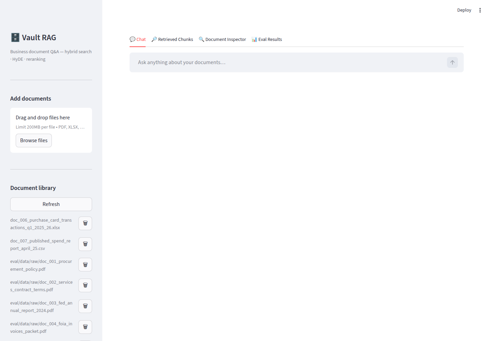
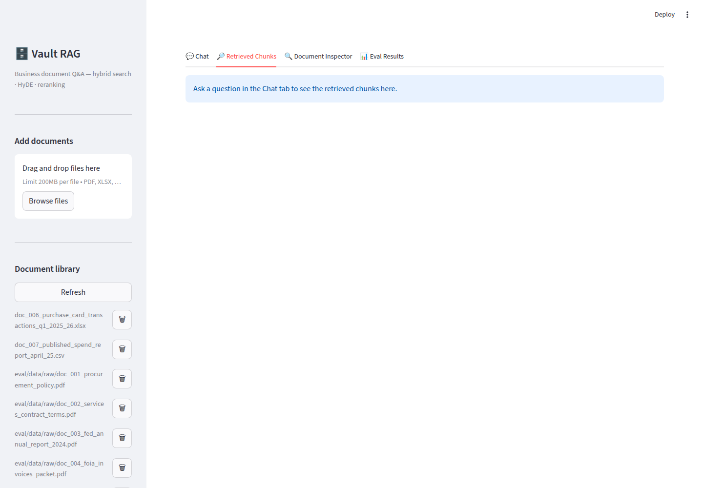
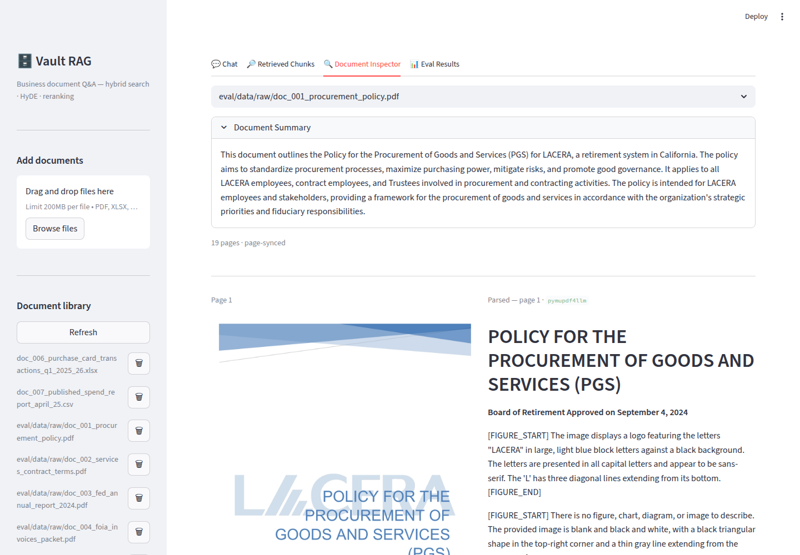
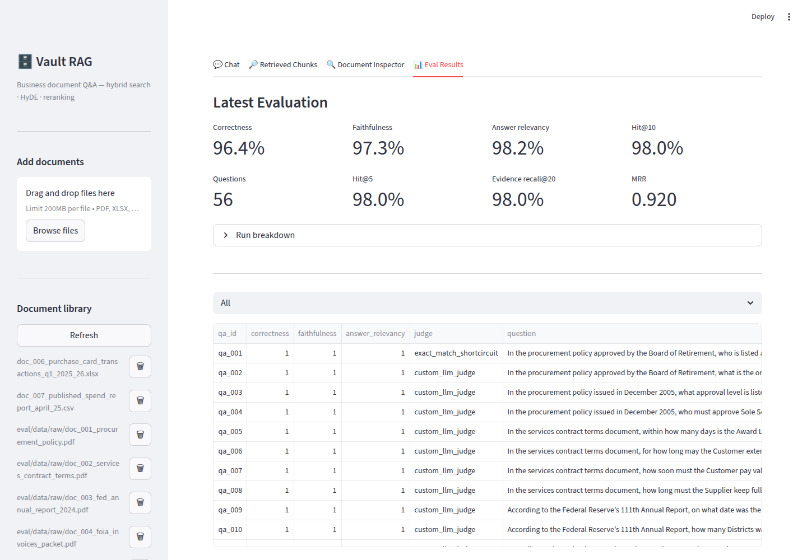

[](https://github.com/k-arvanitis/vault-rag/actions/workflows/ci.yml)


# Vault RAG

A production-minded document intelligence platform for heterogeneous business documents.

Vault RAG is built for the hard case most portfolio RAG demos avoid: messy enterprise document collections with mixed formats, mixed quality, and mixed retrieval needs. Instead of assuming one clean PDF and one chat UI, it ingests contracts, reports, spreadsheets, scanned PDFs, and figures into a single retrieval system, then exposes that system through separate operator and end-user interfaces.

**Privacy callout:** raw document content is parsed and embedded locally; only retrieved chunks are sent to the generation model at query time unless you point those endpoints at a local server too.

The Streamlit app is the operator control plane for ingestion, inspection, and tuning. Slack is the delivery surface for the rest of the team. Underneath both is the same retrieval backend: adaptive parsing, structure-aware chunking, hybrid retrieval, reranking, and cited answers.

**Latest benchmark:** 56 questions over 8 mixed-format public documents: **96.4% correctness**, **97.3% faithfulness**, **98.2% answer relevancy**, and **98% Hit@10**. The cross-document slice scores **90.0% correctness**.

---

## Why Vault RAG is different

Most document RAG demos are optimized for the easiest possible setup: one clean document type, one parser path, one chat UI, and no operational workflow. Vault RAG is designed for real document collections and the engineering tradeoffs they force:

- **Built for heterogeneous corpora** — queries can span contracts, spreadsheets, scanned PDFs, reports, invoices, and figures in the same answer.
- **Adaptive ingestion instead of one parser for everything** — each PDF page is routed independently: born-digital pages use pymupdf4llm while scanned pages use LightOn OCR. Mixed documents are handled correctly without manual preprocessing.
- **Operator workflow separated from user workflow** — the Streamlit app is for ingestion, inspection, and tuning; Slack is the read-only query surface for the team.
- **Retrieval quality engineered as a system** — structure-aware chunking, contextual summaries, hybrid dense+sparse search, HyDE, and reranking work together instead of relying on embeddings alone.
- **Privacy-aware deployment model** — parsing and embeddings run locally, deployments are customer-isolated, and Slack is intentionally query-only.
- **Debuggable by design** — document inspection, per-page pipeline labels, chunk visibility, and Langfuse traces make failures inspectable instead of opaque.

---

## Engineering scope

Vault RAG combines several subsystems that are usually treated separately in document AI products:

- **Adaptive ingestion engine** — routes born-digital and scanned pages differently, repairs OCR table failures, and enriches figures before indexing.
- **Retrieval engine** — unifies structured and unstructured content with hybrid search, reranking, and agentic query decomposition.
- **Operator console** — lets an admin ingest documents, inspect parsed output, validate retrieval, and debug chunk quality.
- **Slack knowledge interface** — gives the team a familiar delivery surface without turning Slack into a document storage layer.
- **Deployment and privacy model** — designed for customer-isolated instances, local parsing/embedding, and controlled data exposure.
- **Observability and evaluation hooks** — chunk inspection, pipeline labels, traces, and an evaluation harness make the system measurable and debuggable.

The project is optimized for mixed-format document operations rather than a narrow single-domain benchmark.

---

## What it does

Upload a mixed business document collection and ask questions in plain English. Vault RAG searches across all indexed files simultaneously and returns a precise, cited answer — pulling from whichever sources actually contain the evidence.

**Example questions across a real document collection:**
- "What are the payment terms in our supplier contract?"
- "What were total sales in Q3 according to the spreadsheet?"
- "Summarise the key risks identified in the audit report."
- "Which invoices from last quarter exceeded the budget cap in the procurement policy?"

Under the hood:
- **Cross-format retrieval** — PDFs (including scanned), Excel, CSV, Word, Markdown, and images are ingested into one unified search index.
- **Per-page routing** — born-digital PDF pages go through pymupdf4llm; scanned pages go through LightOn OCR; figures are described by a vision model before chunking.
- **Structure-aware chunking** — header-aware splitting, token control, small-chunk merging, contextual summaries, and table-aware batching preserve document structure.
- **Hybrid retrieval stack** — dense + sparse vectors are fused via RRF, then reranked by a cross-encoder for better precision.
- **Agentic answering** — a ReAct agent can issue multiple searches, reason across results, and return cited answers with Langfuse traces.

Full technical breakdown in the Architecture and Chunking sections below.
For a shorter engineering narrative, see [docs/CASE_STUDY.md](docs/CASE_STUDY.md).

---

## Interfaces

Vault RAG separates the operator experience from the end-user experience.

### CLI — for scripted ingestion and querying

The module entry points are useful for batch ingestion and headless query testing without launching the browser UI.

```bash
# Ingest a PDF
uv run python -m src.ingest --pdf data/input/report.pdf --collection documents_chunks

# Ingest an Excel / CSV file
uv run python -m src.ingest_table_rows data/input/tables.xlsx --collection documents_chunks

# Ask a question
uv run python -m src.rag_agent --query "What are the payment terms?"
```

### Streamlit UI — for testing and tuning

Before going live, use the Streamlit app to validate your document collection:
inspect how each file chunks, verify OCR output on scanned PDFs, run test
queries and see exactly which chunks were retrieved and why. This is your
tuning environment, not your production UI.

```bash
uv run streamlit run app.py   # → http://localhost:8501
```

### Slack — for your team

The Streamlit UI is for the admin who owns the document collection. Slack is
for everyone else. Once documents are indexed, the whole team can query them
from where they already work — no new tool, no access to manage.

The Slack bot is a **query interface only**. It does not accept file uploads.
Documents are sensitive; they belong in your infrastructure, not in Slack.
The admin indexes them once via Streamlit; the team queries from that point on.

```
@vault what are the payment terms in the supplier contract?
→ Payment is due within 30 days of invoice date. [1]
  [1] contract.pdf, Section 4.2
```

Works in channels (@mention) and DMs (message directly).

**Setup:** create a Slack app, enable Socket Mode, add `SLACK_BOT_TOKEN`
and `SLACK_APP_TOKEN` to `.env`, then:

```bash
make slack            # run locally
make docker-slack-up  # run in Docker
```

See [Slack app setup](#slack-setup) for the full walkthrough.

---

## Demo walkthrough

The fastest way to see the system’s capabilities is to run the operator console and inspect the benchmark artifacts.

```bash
make up                 # Qdrant + OCR stack
ollama pull nomic-embed-text
make app                # Streamlit at http://localhost:8501
make eval-cross         # quick cross-document benchmark
make eval               # full 56-question benchmark
```

Suggested demo flow:

1. Open **Chat** and ask a cross-document question.
2. Open **Retrieved Chunks** to inspect the exact text/table snippets used by the answer.
3. Open **Document Inspector** to compare the original PDF page with parsed Markdown.
4. Open **Eval Results** to compare gold answers, generated answers, metrics, and retrieved evidence row by row.

Demo questions:

```text
A procurement policy document and a services contract terms document both include rules about contract extension or renewal periods. Which allows the longer extension, and what is each period?

In the two Doncaster Council spending documents, what are the amounts for the Google Ads2372193163 row and the SS SYSTEMS LTD row respectively?

What is the salary of the CEO of Doncaster School Solutions?
```

Screenshots:

| Chat | Retrieved chunks |
|---|---|
|  |  |

| Document inspector | Eval results |
|---|---|
|  |  |

---

## Deployment model

Each customer runs their own instance — their own Docker containers,
their own Qdrant collection, their own Slack workspace connection.
No shared infrastructure. Document content never leaves the customer's
environment (parsing and embeddings run locally; only retrieved chunks
are sent to the LLM API).

---

## How chunking works

Chunking is the most important step in the ingestion pipeline — it directly determines retrieval quality. Vault RAG does not simply split text at fixed sizes. It goes through five stages:

### Stage 1 — Header-aware splitting
The parsed Markdown is split along heading boundaries (`#`, `##`, `###`). This keeps logically related content together: a section on "Payment Terms" stays in one chunk rather than being cut mid-sentence across two.

### Stage 2 — Token-limit enforcement
Any section that exceeds the `CHUNK_MAX_TOKENS` limit (default 1024) is further split using LangChain's `RecursiveCharacterTextSplitter`, which tries natural break points (paragraphs → sentences → words) before making a hard cut.

### Stage 3 — Tiny chunk merging
Chunks below `CHUNK_MIN_TOKENS` (default 256 tokens) or below 300 characters are merged into their neighbour. This prevents the index from filling up with stub chunks like a lone heading or a two-word section that would confuse the reranker.

### Stage 4 — Contextual summary (Contextual Retrieval)
For each chunk, `llama-3.1-8b-instant` (Groq) is called with the chunk text and asked to write **one sentence** describing the main topic, entities, and purpose of that specific chunk. For example:

> *"This chunk describes maximum permitted concentration limits for nitrates in drinking water under EU Directive 98/83/EC."*

This sentence is prepended to the chunk text before embedding:
```
CONTEXT: <one-sentence summary>

CONTENT:
<original chunk text>
```

The result is that each vector in the index captures both what the chunk is *about* and what it *says* — dramatically improving retrieval for short or indirect queries. This technique is known as **Contextual Retrieval** ([Anthropic, 2024](https://www.anthropic.com/news/contextual-retrieval)).

### Stage 5 — Table handling
PDF tables detected during OCR are stored as a separate `[TABLE_START]...[TABLE_END]` block. The chunker parses these ASCII grid tables into row-sentence batches (up to 20 rows each), with column headers and part numbers prepended so every table chunk is self-contained. Tables are never split mid-row.

---

## Supported file types

| Type | Parser | What it extracts |
|------|--------|-----------------|
| PDF (born-digital) | pymupdf4llm | Text layer extraction, tables, embedded figures (VLM description) |
| PDF (scanned) | LightOn OCR (local vLLM) | Vision-language OCR, complex layouts, multi-column content |
| Excel / CSV | openpyxl / pandas | All sheets, row batches with headers |
| Word (.docx) | python-docx (via LibreOffice → PDF) | Paragraphs with heading structure |
| Images (.png / .jpg) | Vision (Groq) | Text and visual content description |
| Markdown | Plain text | Heading-aware sections |

---

## Architecture

```
 INGESTION
 ─────────────────────────────────────────────────────────────────

 Upload
   │
   ▼
 ┌──────────────────┐     ┌───────────────────────────────────┐
 │  File type       │────▶│  Parser                           │
 │  detection       │     │  Excel/CSV → openpyxl / pandas    │
 └──────────────────┘     │  Markdown  → plain text           │
                          │  PDF/DOCX  → per-page router ─────┼──┐
                          └───────────────────────────────────┘  │
                                                                  │
                          ┌──────────── PDF page ────────────┐   │
                          │                                  │◀──┘
                          │  text layer ≥ 50 chars?          │
                          │     YES → pymupdf4llm            │
                          │           (CPU, no API call)     │
                          │           figures → VLM (Groq)   │
                          │     NO  → LightOn OCR            │
                          │           (local vLLM, GPU)      │
                          │           figures → Qwen (local) │
                          └────────────────┬─────────────────┘
                                           │ Markdown (per page)
                                           ▼
                          ┌───────────────────────────────────┐
                          │  Chunker                          │
                          │  1. Split on Markdown headers     │
                          │  2. Re-split chunks > 1024 tokens │
                          │  3. Merge tiny chunks             │
                          │  4. Contextual summary per chunk  │
                          │     (llama-3.1-8b-instant / Groq) │
                          └────────────────┬──────────────────┘
                                           │ chunks + context
                                           ▼
                          ┌───────────────────────────────────┐
                          │  Embedder (local Ollama)          │
                          │  nomic-embed-text → dense vector  │
                          │  BM25 (fastembed) → sparse vector │
                          └────────────────┬──────────────────┘
                                           │
                                           ▼
                          ┌───────────────────────────────────┐
                          │  Qdrant                           │
                          │  stores dense + sparse per chunk  │
                          └───────────────────────────────────┘

 QUERY
 ─────────────────────────────────────────────────────────────────

 User question
   │
   ▼
 ┌──────────────────┐     ┌───────────────────────────────────┐
 │  HyDE expansion  │────▶│  Hybrid search (Qdrant)           │
 │  generate a      │     │  dense + sparse → RRF fusion      │
 │  hypothetical    │     │  top-100 candidates               │
 │  answer, embed   │     └────────────────┬──────────────────┘
 └──────────────────┘                      │
                                           ▼
                          ┌───────────────────────────────────┐
                          │  Reranker                         │
                          │  cross-encoder/ms-marco-MiniLM    │
                          │  re-scores top-100 → top-10       │
                          └────────────────┬──────────────────┘
                                           │
                                           ▼
                          ┌───────────────────────────────────┐
                          │  ReAct agent (LangGraph)          │
                          │  llama-3.3-70b-versatile / Groq   │
                          │  can call search tool N times     │
                          └────────────────┬──────────────────┘
                                           │
                                           ▼
                          ┌───────────────────────────────────┐
                          │  Answer with cited sources        │
                          └───────────────────────────────────┘
```

---

## Key engineering decisions

These are the non-obvious choices made during implementation — the ones that are not visible in the architecture diagram but directly determine whether the system works well on real documents.

### Per-page routing: pymupdf4llm vs LightOn OCR

Every PDF page is routed independently to one of two parsers based on whether it has an extractable text layer.

**pymupdf4llm — born-digital pages**

| Property | Detail |
|---|---|
| Runs on | CPU only — no GPU, no model, no API call |
| Speed | Near-instant — a 50-page research paper parses in under a second |
| Accuracy | Lossless — reads characters directly from the PDF byte stream |
| Failure modes | None for text; figures require a separate VLM call (see below) |

Born-digital PDFs (exported from Word, LaTeX, or a browser) embed their text as selectable characters. Running OCR on these is counterproductive: the vision model transcribes what it *sees* in a rendered image, introducing errors on numbers, equations, and code that are already represented perfectly as text. pymupdf4llm skips the model entirely and reads the text layer directly — structure like tables and bold text is preserved in Markdown.

**LightOn OCR — scanned pages**

| Property | Detail |
|---|---|
| Runs on | GPU via local vLLM server |
| Speed | ~2–5 seconds per page depending on GPU |
| Accuracy | State-of-the-art for document OCR; handles multi-column, tables, mixed-language |
| Failure modes | Requires the vLLM server running; born-digital pages are unaffected if it goes down |

Scanned pages have no text layer — pymupdf4llm returns an empty string. A vision-language model is the only option.

The routing threshold is 50 characters of extractable text per page. Mixed documents — a contract where pages 1–10 are digital and page 11 is a faxed addendum — are handled correctly per page with no configuration required.

**Figure descriptions — born-digital path**

Figures in born-digital PDFs come in two forms: raster images written to disk by pymupdf4llm (appear as `` in the Markdown) and vector graphics whose underlying text pymupdf4llm extracts as raw labels (wrapped in `--- Start of picture text ---` blocks — typical for matplotlib or D3 charts). Both types are intercepted, the page region is cropped via fitz, and the image is sent to a vision model (Groq) for a natural-language description. The description is injected inline as `[Figure: ...]` so it enters the chunk index and is searchable.

**Figure descriptions — scanned path**

LightOn OCR does not describe figures natively. When it detects an image in the page it emits an `[IMAGE]` placeholder in its Markdown output. After OCR completes, a post-processing step (`_analyze_page_images_with_qwen`) detects these placeholders, crops the corresponding page regions, and calls a Qwen vision model to generate descriptions. The descriptions are injected in place of the `[IMAGE]` tokens before chunking — same inline `[Figure: ...]` format as the born-digital path.

### Deterministic point IDs (idempotent re-ingestion)

Every chunk stored in Qdrant is assigned a SHA-1 hash of `(file_name, chunk_index)` rather than a random UUID. This means re-ingesting the same file overwrites the existing vectors in place instead of appending duplicates. The consequence: you can update a document, re-run ingestion, and the collection stays consistent without a manual delete step. With random IDs, re-running ingestion on an already-indexed file silently doubles every chunk in the index — a subtle bug that degrades retrieval precision without any visible error.

### Three-pass table repair (no LLM involvement)

Research papers and GHG inventory reports contain tables that OCR cannot handle correctly out of the box. Three specific failure modes are fixed deterministically before any chunk enters the index:

1. **Two-row HTML headers** — OCR outputs `<thead>` with group names (e.g. `KaLMv2`) and places sub-column names (`R@1 R@5 R@10`) in the first `<tbody>` row. The `_fix_html_multirow_header` function detects this pattern structurally (≥50% of the first body row cells match `R@K / NDCG@K` patterns) and derives flattened column names like `KaLMv2 R@1` programmatically.
2. **LaTeX `$\text{...}$` tables** — arXiv papers embed tables as raw LaTeX in the OCR output. The `_preprocess_latex_table` / `_derive_column_names` functions parse the `\textbf{}` header tokens, identify the repeating sub-column unit, and build a correctly aligned markdown table without calling any LLM.
3. **Missing rightmost column** — wide tables in scanned PDFs frequently have the last column dropped by the OCR (a known failure mode in vision-language models for wide layouts). `_fill_empty_last_column_from_text` falls back to the PDF's embedded text layer via `pypdf` and recovers the missing values by positional matching, including splitting concatenated decimals (`2.9524.141` → `2.952`, `4.141`) using fixed-decimal-place regex.

All three repairs are structural — no LLM is called, no hallucination risk, and alignment is guaranteed by counting data-row tokens rather than trusting model output.

### Context-overflow retry with dynamic `rerank_top_n` reduction

When the LLM returns a `400 Bad Request` due to input token overflow (a real failure mode when querying over very dense document collections), the agent automatically retries with `rerank_top_n` halved. The reduced limit persists only for that single request and is reset afterward. This means the system degrades gracefully under load — a shorter but valid answer is returned instead of a crash — without ever needing to set a permanently conservative chunk count.

### Hybrid-to-dense fallback

At query time, the retriever checks whether the Qdrant collection actually contains sparse vectors before attempting a hybrid query. If sparse vectors are absent (e.g. a collection indexed before the sparse embedder was added), it falls back to dense-only search silently. This means old index versions remain queryable without schema migration, and the system does not crash on collections that were ingested with an earlier pipeline version.

### Document-level summary chunk

At ingest time, a separate 3–5 sentence summary of the whole document is generated and stored as a dedicated chunk with `chunk_type: "document_summary"` in its metadata. General questions ("what is this paper about?", "give me an overview of the report") retrieve this chunk directly without scanning all content chunks. This avoids the common failure mode where a top-level question retrieves a random mid-document chunk because the summary information is distributed across too many pieces.

### HyDE improves recall on vague queries

Instead of embedding the raw user question, the agent first generates a *hypothetical answer* using a fast LLM call and embeds that. The embedded hypothetical answer is semantically much closer to the real document text than a short question, significantly improving recall for queries like "what were the sales figures" where the question itself shares few tokens with the answer. The trade-off is one extra LLM call per query (~200ms on Groq); the ablation study quantifies the metric gain.

---

## Tech stack

| Component | Technology | Why |
|-----------|-----------|-----|
| PDF parsing — text layer | pymupdf4llm | Chosen for born-digital pages because reading the existing text layer is faster and more faithful than OCR, especially for numbers, tables, equations, and code |
| PDF parsing — scanned | LightOn OCR (local vLLM) | Chosen for scanned pages because they have no usable text layer; running OCR locally preserves privacy while still handling image-only documents |
| Figure descriptions | llama-4-scout-17b (Groq vision) | Chosen to turn charts, diagrams, and embedded visuals into searchable text so evidence inside figures is retrievable instead of silently dropped |
| Contextual summaries | llama-3.1-8b-instant (Groq) | Chosen because a fast, low-cost model can add chunk-level context at ingest time, improving retrieval quality without adding latency to every query |
| Embeddings | nomic-embed-text (Ollama) | Chosen as a strong local embedding model so indexing stays on-prem and semantic search works without paying an external API for every chunk |
| Vector database | Qdrant | Chosen because this project needs dense+sparse retrieval in one system, plus simple local Docker deployment for reproducible demos and self-hosting |
| Reranker | cross-encoder/ms-marco-MiniLM-L-6-v2 | Chosen because first-pass retrieval maximizes recall over a broad candidate pool, then a lightweight cross-encoder recovers precision before generation |
| Generation | llama-3.3-70b-versatile (Groq) | Chosen to get strong answer synthesis and multi-step reasoning without requiring a local high-end GPU for the final response stage |
| UI | Streamlit | Chosen because the operator workflow is iterative and inspection-heavy, so a Python-native UI is faster to build and modify than a custom frontend |
| Agent | LangGraph (ReAct) | Chosen because the answering flow sometimes needs iterative retrieval, query reformulation, and explicit tool state instead of a single retrieve-then-generate pass |
| Observability | Langfuse | Chosen because retrieval systems fail in opaque ways, and end-to-end traces make it possible to inspect prompts, tool calls, retrieved chunks, and token usage |

---

## Privacy & data

- **Parsing** runs locally. Born-digital PDF pages are processed by pymupdf4llm on CPU with no network calls. Scanned pages go to the LightOn OCR server (vLLM on your GPU, also local). Raw document bytes never leave the machine.
- **Embeddings** are generated locally by Ollama — document text never leaves the machine at indexing time.
- **Contextual summaries** (written per chunk at ingest time) are sent to the Groq API along with the chunk text. If this is unacceptable, point `CHUNK_LLM_API_BASE` at a local vLLM server and set `CHUNK_LLM_MODEL` accordingly.
- **LLM inference** at query time sends only the retrieved chunks and the user query to the Groq API. To go fully air-gapped, point `GENERATION_API_BASE` at a local vLLM server and set `GENERATION_MODEL` accordingly.

---

## Quickstart

```bash
git clone https://github.com/k-arvanitis/vault-rag.git && cd vault-rag
uv sync
cp .env.example .env          # set GROQ_API_KEY
make up
ollama pull nomic-embed-text
make app                      # → http://localhost:8501
```

GPU required for LightOn OCR. See [Setup](#setup) for full prerequisites and configuration options.

---

## Docker deployment

The root `docker-compose.yaml` brings up the full stack in one command — no local Python environment or Ollama installation required.

```bash
cp .env.example .env          # set GROQ_API_KEY (and OPENROUTER_API_KEY for chunking)
docker compose up -d --build  # or: make docker-up
```

This starts four services:

| Service | Image | Purpose |
|---|---|---|
| `qdrant` | `qdrant/qdrant:v1.17.0` | Vector database (dense + sparse) |
| `litellm` | `ghcr.io/berriai/litellm` | LLM proxy — Groq primary, OpenRouter fallback |
| `ollama` | `ollama/ollama:latest` | Local embedding model (nomic-embed-text pulled on first start) |
| `app` | built from `Dockerfile` | Streamlit operator console at `http://localhost:8501` |

The first start takes a few minutes while Ollama pulls the embedding model (~274 MB). Subsequent starts are instant.

**With GPU (scanned PDF support):**

```bash
make docker-up-gpu            # adds the LightOn OCR vLLM container
```

Requires the NVIDIA container runtime and a CUDA 12+ GPU. Born-digital PDFs, Excel, and Markdown work without it.

> **Image size note:** the `app` image is ~5 GB because PyTorch includes CUDA libraries even when running on CPU. This is normal for ML workloads — the reranker and embedding model run on CPU regardless.

---

## Setup

### Prerequisites

| Tool | Minimum version | Purpose |
|------|----------------|---------|
| Python | 3.11 | Application runtime |
| uv | 0.4+ | Fast dependency management |
| Docker + Compose | 24+ | Qdrant + optional LightOn OCR server |
| Ollama | 0.4+ | Local embedding model |
| GPU (optional) | CUDA 12 | Required for LightOn OCR; CPU fallback is slow |

### Installation

```bash
git clone https://github.com/k-arvanitis/vault-rag.git
cd vault-rag

# Install dependencies
uv sync

# Configure environment
cp .env.example .env
# Edit .env — at minimum set GROQ_API_KEY

# Start Qdrant + LightOn OCR
make up

# Pull embedding model
ollama pull nomic-embed-text

# Start the app
make app
```

### Optional services and fallback behavior

- **Langfuse is optional** — if Langfuse env vars are unset, the app still runs; you just lose tracing and run inspection.
- **LightOn OCR requires a CUDA GPU** for usable performance. Born-digital PDFs still work without it because they bypass OCR entirely, but scanned PDFs depend on the OCR server.
- **If `OCR_API_BASE` is unavailable**, scanned-page ingestion fails for those pages; there is no automatic fallback parser for image-only PDFs. Born-digital pages continue through the text-layer path.
- **No GPU available?** You can still use the project for born-digital PDFs, spreadsheets, Markdown, DOCX, and other non-scanned inputs. The main limitation is scanned/image-heavy PDFs.

---

## Configuration

All variables can be set in `.env`. See `.env.example` for a full annotated list.

| Variable | Default | Description |
|----------|---------|-------------|
| `GROQ_API_KEY` | _(required)_ | Groq API key — free tier at console.groq.com |
| `GENERATION_API_BASE` | `https://api.groq.com/openai/v1` | OpenAI-compatible generation endpoint |
| `GENERATION_MODEL` | `llama-3.3-70b-versatile` | LLM used for query answering |
| `CHUNK_LLM_API_BASE` | `https://api.groq.com/openai/v1` | Endpoint for contextual summary LLM (ingest only) |
| `CHUNK_LLM_MODEL` | `llama-3.1-8b-instant` | Model used to write one-sentence context per chunk |
| `OLLAMA_API_BASE` | `http://127.0.0.1:11434` | Ollama server URL |
| `OLLAMA_EMBED_MODEL` | `nomic-embed-text` | Embedding model (Ollama) |
| `QDRANT_URL` | `http://localhost:7333` | Qdrant REST endpoint |
| `QDRANT_COLLECTION` | `documents_chunks` | Qdrant collection name |
| `OCR_API_BASE` | `http://127.0.0.1:8002` | LightOn OCR vLLM endpoint |
| `OCR_MODEL` | `lightonocr-2-1b-ocr-soup` | LightOn OCR model name |
| `RERANKER_MODEL` | `cross-encoder/ms-marco-MiniLM-L-6-v2` | HuggingFace reranker model |
| `RERANKER_DEVICE` | `cpu` | Device for reranker (`cpu` or `cuda`) |
| `RETRIEVAL_TOP_K` | `100` | Candidates retrieved before reranking |
| `RERANK_TOP_N` | `10` | Top chunks passed to the LLM after reranking |
| `CHUNK_MAX_TOKENS` | `1024` | Maximum tokens per chunk |
| `CHUNK_MIN_TOKENS` | `256` | Minimum tokens per chunk (smaller chunks are merged) |
| `IMAGE_SIZE_LIMIT` | `0.05` | Fraction of page area; images smaller than this are skipped by pymupdf4llm |
| `VLM_ENABLED` | `true` | Set `false` to skip VLM figure descriptions entirely (faster ingestion, no Groq calls) |
| `VLM_PROVIDER` | `groq` | Provider for figure description calls |
| `VLM_MODEL` | `meta-llama/llama-4-scout-17b-16e-instruct` | Vision model used for figure descriptions |

---

## Slack setup

### 1. Create a Slack app

Go to [api.slack.com/apps](https://api.slack.com/apps) → **Create New App** → **From scratch**.

### 2. Enable Socket Mode

**Settings → Socket Mode** → Enable. This creates the App-Level Token (`xapp-...`) — copy it to `SLACK_APP_TOKEN`.

### 3. Add Bot Token Scopes

**OAuth & Permissions → Scopes → Bot Token Scopes**, add:

| Scope | Purpose |
|-------|---------|
| `app_mentions:read` | Receive @mention events |
| `chat:write` | Post messages and replies |
| `im:history` | Receive DM messages |
| `im:write` | Reply in DMs |

### 4. Subscribe to events

**Event Subscriptions → Subscribe to bot events**, add:
- `app_mention`
- `message.im`

### 5. Install and configure

**OAuth & Permissions → Install to Workspace** → copy the Bot User OAuth Token to `SLACK_BOT_TOKEN`.

Add both tokens to `.env`:

```
SLACK_BOT_TOKEN=xoxb-...
SLACK_APP_TOKEN=xapp-...
```

### 6. Start the bot

```bash
make slack            # local
make docker-slack-up  # Docker
```

Invite the bot to a channel: `/invite @vault-rag`

---

## Evaluation

56-question benchmark over 8 real public documents: procurement policies, legal contracts, government annual reports, scanned invoice packets, FOIA disclosures, and Excel/CSV spend reports. Questions span four categories: single-document factoid, table lookup, cross-document comparison, and unanswerable (questions with no supporting evidence).

Answer quality is judged by a controlled LLM-as-judge harness using `gpt-4o-mini`, exact-match short-circuiting for deterministic answers, and retrieved-context selection around the answer and gold evidence terms. Retrieval metrics are computed deterministically against gold evidence annotations.

DeepEval remains available as an ablation mode, but it is not the primary reported run. In this benchmark it made several schema-constrained calls per answer; with Qwen judges it produced invalid JSON, and with GPT-mini judges it frequently timed out or under-scored faithfulness when context was aggressively trimmed. The default evaluator therefore uses one compact JSON-only judge call per non-exact answer so the reported scores reflect the RAG pipeline rather than evaluator instability.

### Results

| Category | Questions | Correctness |
|---|---|---|
| Single-doc factoid | 32 | Included in overall |
| Table lookup | 8 | Included in overall |
| Cross-document comparison | 10 | 90.0% |
| Unanswerable | 6 | 100% exact-match short-circuit |
| **Overall** | **56** | **96.4%** |

| Answer metric | Score |
|---|---:|
| Correctness | 96.4% |
| Faithfulness | 97.3% |
| Answer relevancy | 98.2% |

| Retrieval metric | Score |
|---|---:|
| Hit@5 | 98% |
| Hit@10 | 98% |
| Evidence recall@10 | 96% |
| Evidence recall@20 | 98% |
| MRR | 0.92 |

Judge breakdown for the latest full run:

| Judge path | Questions |
|---|---:|
| Exact-match short-circuit | 22 |
| Custom LLM judge | 34 |

**Retrieval is near-perfect.** The 98% hit@5/hit@10 and 0.92 MRR confirm the hybrid dense+sparse retrieval, HyDE expansion, and reranking pipeline is working. Evidence recall at 98% by rank 20 means nearly all gold evidence is present for the answerer.

**Cross-document comparison is now strong.** The 10 cross-document questions require the agent to identify the right sources, run separate retrieval passes when needed, and synthesize values without mixing documents. The latest cross-document slice scores 90.0% correctness, 95.0% faithfulness, and 100% answer relevancy.

**Unanswerable accuracy at 100%** means the agent correctly abstains on all six questions that have no supporting evidence in any indexed document — no hallucination under pressure.

The main residual misses are OCR/source-quality issues in the scanned invoice packet, not the agentic cross-document retrieval path.

Benchmark assets:
- `eval/document_manifest.json` — frozen corpus metadata, hashes, and stable `doc_id`s
- `eval/data/rag_eval_benchmark_56qa_revised.jsonl` — gold questions and evidence annotations
- `eval/run_eval.py` — evaluation runner (custom LLM judge + deterministic retrieval metrics; DeepEval ablation available with `EVAL_JUDGE_MODE=deepeval`)
- `eval/results/run_final_20260504_summary.json` — pinned final summary for the portfolio run
- `eval/results/run_final_20260504_answer_results.jsonl` — pinned gold-vs-generated answer rows
- `eval/results/run_final_20260504_retrieval_results.jsonl` — pinned retrieval/evidence rows

Full benchmark methodology, judge design decisions, and reproduction steps in [eval/README.md](eval/README.md).

---

## Tests

126 tests, all mocked — no live services (Ollama, Qdrant, Groq) required to run CI.

| File | Tests | What's covered |
|------|-------|----------------|
| `test_chunker.py` | 3 | Token limits, minimum chunk size, required output fields |
| `test_config.py` | 5 | Config invariants: types, model family constraints |
| `test_retriever.py` | 17 | Cosine similarity math, text filter shape, retrieve from local JSON, dense and hybrid Qdrant paths |
| `test_reranker.py` | 10 | BGEReranker and QwenReranker: output format, sort order, top-n, score ranges |
| `test_rag_agent.py` | 52 | `ask_agent` history injection and answer extraction, `stream_agent` token streaming and `<think>` suppression, chunk collection, system prompt invariants, doc registry injection, cross-document repair |
| `test_table_repair.py` | 13 | Three-pass table repair: two-row HTML headers, LaTeX column derivation, missing last-column recovery |
| `test_pdf_parser.py` | 6 | Per-page routing (text-layer vs scanned), VLM enable/disable, VLM exception handling, mixed documents |
| `test_excel_cleaner.py` | 4 | Excel sheet filtering, row-value skipping, no-data token handling |
| `test_slack.py` | 16 | Slack bot message routing, DM handling, mention parsing, answer formatting |

```bash
uv run pytest tests/ -v
```

---

## Known limitations

- **English-only retrieval/generation workflow** — the current prompting and retrieval setup is optimized for English. Non-English documents can be indexed, but cross-language retrieval is not supported.
- **Scanned PDFs require a GPU-backed OCR service** — LightOn OCR needs a CUDA-capable GPU for practical use. Without it, the project still works for born-digital PDFs and tabular/text files, but scanned-page ingestion is not a viable path.
- **No automatic fallback when OCR is unavailable** — if `OCR_API_BASE` is down, scanned-page ingestion fails for those pages instead of falling back to another parser. Born-digital pages are unaffected.
- **Contextual enrichment adds ingest latency** — one LLM call is made per chunk, plus one more for the document summary. Large documents can produce hundreds of calls, so ingestion can take several minutes on rate-limited endpoints.
- **Cross-document aggregation is limited** — the agent can retrieve evidence from multiple documents, but it is not designed as a spreadsheet engine for robust operations like summing Q3 revenue across all uploaded files.
- **Very large Excel files** — files with 100k+ rows or 20+ sheets are ingested fully into memory. Expect slow ingestion and possible OOM errors; consider pre-filtering sheets before upload.
- **Password-protected PDFs** — LightOn OCR receives the raw bytes and will fail or return empty output. There is no detection or user-facing warning; the file silently ingests as an empty document.
- **Low-quality scans** — severely skewed, low-DPI, or handwritten content degrades LightOn OCR accuracy. Ingestion does not fail, but retrieved text may contain OCR artefacts that hurt retrieval precision. Born-digital pages are unaffected (they bypass OCR entirely).
- **VLM figure descriptions** — vector graphics in PDFs (e.g. matplotlib charts exported as PDF vectors) are rasterised and sent to Groq for description. If `GROQ_API_KEY` is unset or the Groq API is unavailable, figures are replaced with `[Figure: description unavailable]` and ingestion continues. Set `VLM_ENABLED=false` to skip all figure description calls.
- **Complex PDF table layouts** — merged cells, rotated headers, and tables spanning multiple pages are parsed heuristically. The three-pass table repair handles common academic/GHG-report patterns; novel layouts may produce misaligned row-sentence chunks.
- **Streaming and context overflow** — the adaptive `rerank_top_n` retry on context overflow is implemented only in `ask_agent`. The streaming path (`stream_agent`) does not retry; it will raise a `BadRequestError` on overflow. Use `ask_agent` for large document collections.

---

## Project structure

```text
vault-rag/
├── app.py                     # Streamlit operator console
├── slack_app.py               # Slack bot (Socket Mode)
├── main.py                    # CLI entry point (ingest / query without the UI)
├── litellm_config.yaml        # LiteLLM proxy config (Groq primary → OpenRouter fallback)
├── Makefile
├── pyproject.toml
├── src/
│   ├── config.py              # Single source of truth for all env vars
│   ├── ingest.py              # File-type router → parser → chunker → embedder → Qdrant
│   ├── ingest_table_rows.py   # Row-batched ingestion for Excel / CSV
│   ├── ingest_tables.py       # Table-aware ingestion for PDF tables
│   ├── chunker.py             # 5-stage chunking pipeline
│   ├── embedder.py            # Dense embedding (Ollama nomic-embed-text)
│   ├── sparse_embedder.py     # Sparse embedding (BM25 via fastembed)
│   ├── retriever.py           # Hybrid search, HyDE, reranking
│   ├── reranker.py            # Cross-encoder reranker (ms-marco-MiniLM)
│   ├── table_processor.py     # Three-pass deterministic table repair
│   ├── rag_agent.py           # LangGraph ReAct agent + streaming
│   ├── vector_store.py        # Qdrant upsert / delete helpers
│   ├── excel_tool.py          # Agent tool for structured Excel queries
│   ├── parser/
│   │   ├── pdf_parser.py      # Per-page router (born-digital vs scanned)
│   │   └── lightonocr_parser.py
│   ├── ingestion/
│   │   ├── ocr.py             # LightOn OCR (local vLLM)
│   │   └── vlm.py             # VLM figure descriptions (Groq)
│   └── preprocessing/
│       ├── excel_cleaner.py   # Sheet normalisation and header repair
│       └── chunk_builder.py   # SheetResult → chunk dicts
├── scripts/
│   ├── check_providers.py     # LiteLLM provider health check
│   ├── embedding_server.py
│   └── reset_tables.py
├── tests/
├── docker/
│   └── ingestion-stack/
├── eval/
│   ├── README.md              # Benchmark design, judge methodology, and reproduction steps
│   ├── run_eval.py            # Evaluation runner (LLM judge + deterministic retrieval metrics)
│   ├── synthesize_qa.py       # Gold QA pair generation from documents
│   ├── document_manifest.json # Frozen corpus metadata and stable doc_ids
│   ├── data/                  # Gold QA files per document and cross-document slices
│   └── results/               # Pinned run outputs (summary, answer rows, retrieval rows)
├── docs/
│   ├── CASE_STUDY.md
│   └── screenshots/
└── data/
    ├── input/
    └── output/
```

## Failure modes

| Component | What fails | Symptom | Fix |
|---|---|---|---|
| LightOn OCR | vLLM server not running | Scanned pages fail with `Connection refused` on port 8002; born-digital pages are unaffected | `cd docker/ingestion-stack && ./up.sh` |
| VLM (figure descriptions) | Groq API unavailable or `VLM_ENABLED=false` | Figures replaced with `[Figure: description unavailable]`; ingestion continues | Set `GROQ_API_KEY` or set `VLM_ENABLED=false` to opt out |
| Qdrant | Container not running | All queries return empty results | `docker compose up -d qdrant` |
| Ollama / nomic-embed-text | Model not pulled | Embedding step fails | `ollama pull nomic-embed-text` |
| Groq API | Missing or invalid `GROQ_API_KEY` | Generation returns 401 | Set `GROQ_API_KEY` in `.env` |
| Groq API | Rate limit hit | Slow or failed responses | Retry or use a local vLLM via `GENERATION_API_BASE` |
| Reranker | Model not downloaded | First query is slow (~30s download) | Pre-download: `uv run python -c "from sentence_transformers import CrossEncoder; CrossEncoder('cross-encoder/ms-marco-MiniLM-L-6-v2')"` |
| File ingestion | Unsupported format uploaded | Silent skip with error toast | Only PDF, Excel, CSV, MD, DOCX, images are supported |
