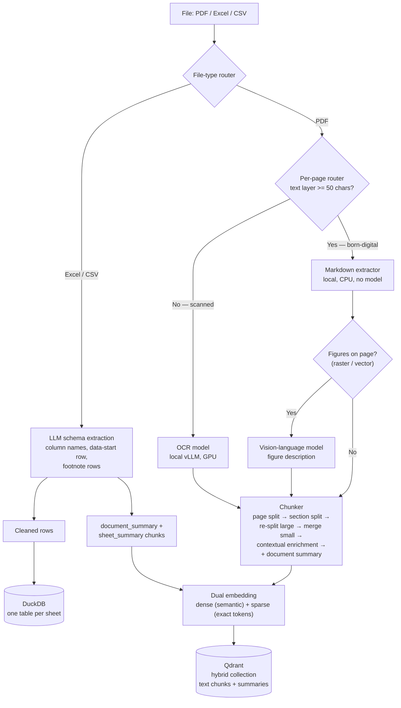
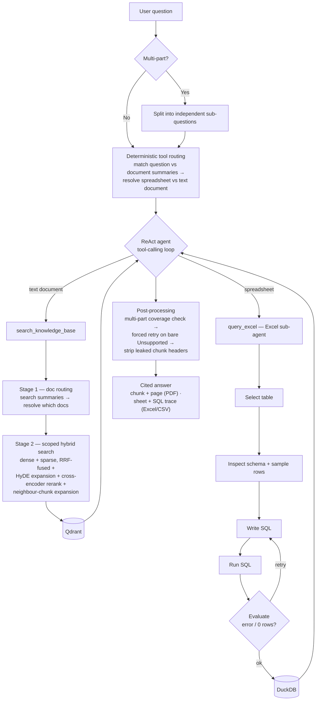

# Vault RAG — Architecture Diagrams

Mermaid source for the two pipelines. Renders on GitHub, in most markdown
viewers, and at [mermaid.live](https://mermaid.live).
Companion: [ARCHITECTURE.md](ARCHITECTURE.md) (narrative).

---

## 1. Ingestion pipeline

---

## 2. Query pipeline

